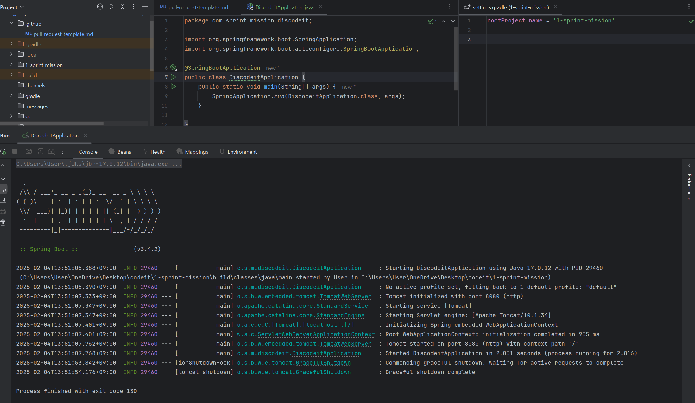

## 요구사항

### 기본 요구사항

- [x] 스프린트 미션#4에서 구현한 API를 RESTful API로 리팩토링하세요.

    1. 클래스 외, 메서드에 지정된 @RequestMapping -> @{HTTPMethod}Mapping 으로 변경

        - 직관적인 명시

    2. Patch 메서드를 썼던 update를 Put 메서드로 변경

        - 명확히 부분 변경을 의도로 가지고 한 게 아니라, 필드 부분 수정할 게 없다고 판단될시 Put으로 변경

    3. Create 메서드의 상태 코드 반환 200 ok -> 201 Created로 변경

        - PUT 또한 전체가 변경되는 것이기에, 자원 표현 명시성과 캐시의 동기화 때문에 200 ok를 쓰는 게 RESTful 하다고 하지만,
        - 처음 update 관련된 것들은 응답 본문(body)을 반환하지 않겠다 결정했기 때문에 204 고정합니다.

          #### UserController 클래스에서

            1. login 메서드를 AuthController 클래스로 분리

            - 사용자 리소스와 관련된 기능이 아니라, **인증에 관련된 리소스**이기 때문에.

            2. updateUser 메서드를 @PutMapping, updateUserStateByUserId 메서드를 @PatchMapping 으로 매핑

            - User를 업데이트할 때는 전체 수정, UserState를 업데이트할 때는 부분 수정한다.
            - UserState를 업데이트할 때 User 전체의 정보를 받을 필요가 없고, UserState는 User Entity가 존재하지 않는다면 독립적으로 존재할
              필요가
              없는
              Entity이기 때문에 엔드포인트로 나누기 보다 Patch를 통한 update를 한다.

- [x] Postman을 활용해 컨트롤러를 테스트 하세요.
    - Postman API 테스트 결과를 다음과 같이 export하여 PR에 첨부해주세요.
    - [스프린트 미션 5.postman_collection.json](../../%EC%8A%A4%ED%94%84%EB%A6%B0%ED%8A%B8%20%EB%AF%B8%EC%85%98%205.postman_collection.json)
- [x] springdoc-openapi를 활용하여 Swagger 기반의 API 문서를 생성하세요.
- [x] Swagger-UI를 활용해 API를 테스트해보세요.

### 심화 요구사항

- [x]  다음의 API 스펙을 준수하여 API를 리팩토링하세요.
    - 도메인 모델 User : DTO 역할을 하는 UserFindResponse 의 필드 `boolean isConnected` -> `boolean online` 으로 변경
    - 도메인 모델 User : 유저 생성 API의 반환 값 `User` Entity 로 변경

    - 도메인 모델 ReadStatus : MessageReceiptController 의 엔드 포인트 변경 `/api/message-receipt` ->
      `/api/readStatuses`
    - 도메인 모델 ReadStatus : 메세지 읽음 상태 목록 조회 API 반환 값 `ReadStatus` Entity 로 변경
    - 도메인 모델 ReadStatus : DTO 역할을 하는 `ReadStatusCreateRequest`의 필드에 `Instant lastReadAt` 추가및
      ReadStatus
      Entity의 읽은 시각을 요청이 들어오면, 요청이 들어오는 시각으로 refresh 하는 방식에서 클라이언트 쪽에서 시각을 받는 것으로 변경

    - 도메인 모델 Message : 메세지 생성 `Message` Entity 로 변경
    - 도메인 모델 Message : 채널 Id로 메세지 조회 API 반환 값 `List<Message>` Entity 로 변경
    - **등... (이후 다 비슷한 패턴이기에 생략)**

- [x]  다음의 정적 리소스를 서빙하여 프론트엔드와 통합해보세요. API 스펙을 준수했다면 잘 동작할거예요.
  

- [ ]  Railway.app을 활용하여 애플리케이션을 배포해보세요.
- Railway.app은 애플리케이션을 쉽게 배포할 수 있도록 도와주는 PaaS입니다.
    - [ ] Railway.app에 가입하고, 배포할 GitHub 레포지토리를 연결하세요.
    - [ ] Settings > Network 섹션에서 Generate Domain 버튼을 통해 도메인을 생성하세요.
    - [ ] 생성된 도메인에 접속해 배포된 애플리케이션을 테스트해보세요.

## 주요 변경사항

1. UserController 에서 프로필 이미지를 받는 부분의 변경으로 인해 updateUser 또한 변경
   updateUserRequest 의 binaryContent 제거하고, 요청으로 파일을 받는다.

2. 스프린트 4에서 수정하지 않았던 MessageController 에서의 첨부파일 용 binaryContent 생성 수정

3. SpringBoot 버전 3.4.1 -> 3.3.6 변경

   java.lang.NoSuchMethodError: 'void org.springframework.web.method.ControllerAdviceBean.<init>(
   java.lang.Object)'

- java 에서 메소드를 찾지 못했을 때 뜨는 오류인데,
- Spring은 내부적으로 ControllerAdviceBean이라는 클래스가 @ControllerAdvice가 붙은 클래스를 관리한다.
- Swagger 가 사용하는 Spring의 버전과 실제 애플리케이션이 사용하는 Spring 버전이 다르면
- ControllerAdviceBean 의 생성자 시그니처(어떤 파라미터를 받는지)가 다를 수 있다.
- 때문에 Swagger 와 맞는 버전으로 SpringBoot 버전을 수정했다.

4. 채널 Id로 메세지 조회 API를 위해 만들어진 Service 레이어 기능 반환값 Collection 에서 List 로 변경 *통일성을 위해

5. Channel 삭제 api 엔드 포인트 수정, channel Type까지 @PathVariable 에노테이션을 통해 전달 받았는데, channel Type이 삭제될 때
   유의미하게 사용되지 않고, 엔드 포인트를 보다 더 가독성있게 하기 위해, 또 스프린트 미션 5 API 스펙 준수를 위해 삭제했습니다

6. 다중 리소스 검색 기능을 띈 API 기능들을 @RequestParam 에서 @RequestParam으로 에노테이션을 변경했습니다.

7. binaryContentFindAll -> findAllByIdIn 로 API 기능 변경

## 스크린샷

## 멘토에게

- channel 생성 API 부분에 request 조건을 못 맞췄는데, 이전 멘토님의 조언으로 Channel-User의 관계를 별도의 Entity로 관리하고 있어서, 요청시
  userId를 받아오지 않으면 관련 로직을 전부 뜯어 고쳐야하는 상황이라 그 부분 로직은 수정하지 못했습니다.* 때문에 정적 리소스 사이트에서 Channel 생성이
  불가능합니다.
