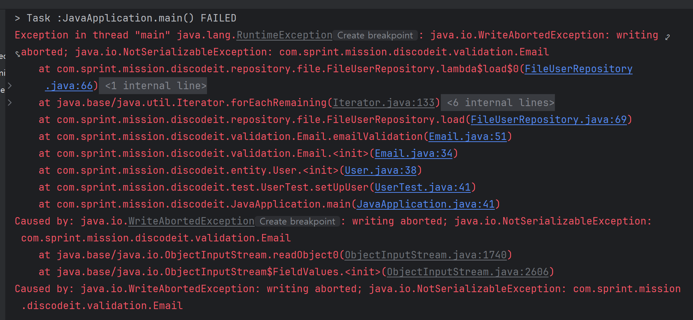
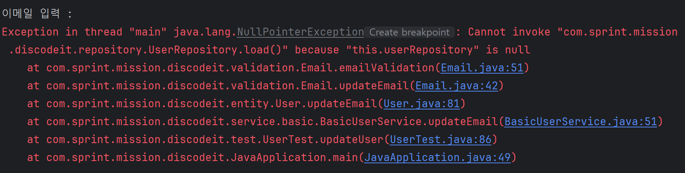
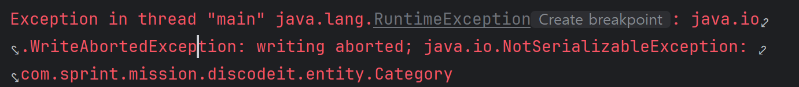
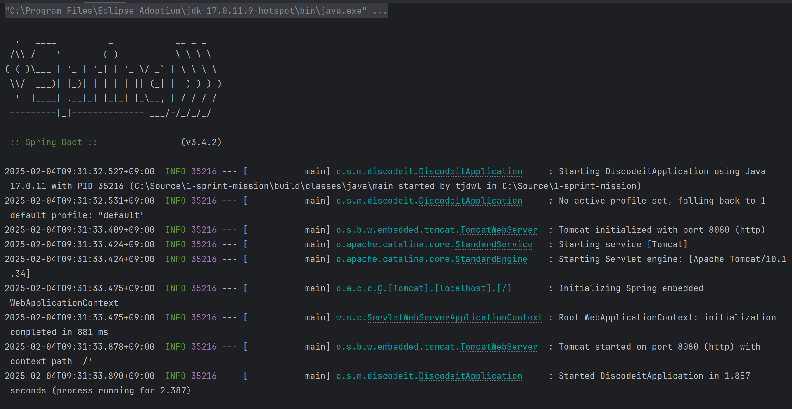

# Spring 백엔드 트랙 1기 스프린트 미션 제출 리포지토리

---

## 디스코드 분석

---

- 디스코드 구조 : 서버 > **카테고리** > **채널** > **스레드(메시지)**
- 카테고리명과 채널명은 중복 가능 (UUID를 통해 구분되는 것으로 추정)
- 서버 생성 시 채팅 채널과 음성 채널 카테고리, 일반 채널이 기본적으로 만들어짐
- 채널 생성 시 기본적으로 카테고리 설정되지 않음
  - 카테고리 설정 위해서는 채널을 생성한 뒤 원하는 카테고리로 변경해야 함

<br>

## 스프린트 미션 진행 현황

---

### 스프린트 미션 1
1. **프로젝트 초기화**
   - JDK 17 사용
   - Build System: Gradle-Groovy
2. **도메인 모델링(Entity)**
   1. 도메인 모델 정의
      1. User
         - pk, 생성 일자, 변경 일자, 이메일(아이디), 비밀번호, 이름, 닉네임, 전화번호
      2. Channel
         - pk, 생성 일자, 변경 일자, 채널 주인 pk, 채널 카테고리, 채널 이름, 채널 설명, 멤버 목록
      3. Message
         - pk, 생성 일자, 변경 일자, 채널 pk, 작성자 pk, 메시지 내용
   2. 생성자를 통해 각 필드 초기화
   3. getter, update 함수 정의
3. **서비스 설계 및 구현**
   1. 인터페이스 작성
   2. 인터페이스 구현체 작성 (JCF*Service)
      - Collection 프레임워크를 DB 대체로 사용
      - Map<UUID, 각 entity 타입> data = new HashMap<>();
        - 주로 검색 용도이고, 삭제가 잦지 않으므로 HashMap 사용
      - data 공유를 위해 싱글톤 패턴으로 작성
4. Main 클래스에서 각 메서드 테스트

---

### 스프린트 미션 2
1. **File IO를 통한 데이터 영속화**
   1. 인터페이스 작성
   2. 인터페이스 구현체 작성 (File*Service)
      - 객체 직렬화를 통해 파일로 객체 저장
      - 객체 역직렬화를 통해 파일에 저장된 객체 불러옴
2. **서비스 구현체 분석**
   - JCF*Service의 경우 Collection 프레임워크를 통해 데이터를 저장하고 불러옴
   - File*Service의 경우 직렬화/역직렬화를 통해 데이터를 저장하고 불러옴
3. **레포지토리 설계 및 구현**
   1. 인터페이스 작성
   2. 인터페이스 구현체 작성 
      1. JCF*Repository
         - Map<UUID, *> data
         - data에 데이터 저장/불러오기/삭제 메서드 작성
      2. File*Repository
         - 파일에 데이터 저장/불러오기/삭제 메서드 작성
4. **service의 저장 로직을 repository로 대체**
5. **관심사 분리를 통한 레이어 간 의존성 주입**
   - basic 패키지에 Basic*Service 만듦
   - Service의 비즈니스 로직 작성
         
### 수정사항

1. **유효성 검사 수정**
   - 기존 코드는 service에 책임이 치중되어 있었음
     - 문제점: 중복코드 과다, 절차지향적 코딩
   - 유효성 검사에 대한 책임을 각 entity에 넘김
     - 단순 null 확인은 각 entity 클래스에 작성
     - 그 이상의 유효성 검사(정규식 등)가 필요할 경우 클래스 분리
2. **category entity 추가**
3. **의존성 주입**
   - Channel에 User에 대한 의존성 주입 (생성자 주입)
   - Category와 Message에 Channel에 대한 의존성 주입 (생성자 주입)
   - 각 Service단에 Repository에 대한 의존성 주입 (생성자 주입)
4. **일급 컬렉션 사용**
   - data 패키지 만듦
   - UserData, ChannelData, MessageData 클래스 생성

### 트러블 슈팅

1. **FileUserService 실행 시 RuntimeException 발생**

   

   - 현재 validation 패키지에 있는 Email 클래스의 멤버 변수인 UserRepository 인터페이스가 직렬화 불가능이라 생기는 문제로 추정
      - transient 키워드 사용 → 해결
      - transient
         - 해당 키워드가 적용된 필드는 Serialize하는 과정에서 제외됨
         - static이나 final 키워드가 붙은 경우 효과 없음

2. **UserTest 클래스의 userService.updateEmail(id, email) 실행 시 NullPointerException 발생**

   

   - 직렬화할 때 적용한 transient 키워드로 인해 역직렬화 시 userService가 null로 초기화되어 발생한 문제로 추정
      - readObject 메서드 사용
         - 역직렬화 시 자동으로 호출됨
         - 반드시 private으로 선언해야 함

          ```java
          private void readObject(ObjectInputStream ois) throws IOException, ClassNotFoundException {
                  // 역직렬화 실행
                  ois.defaultReadObject();
                  
                  // 역직렬화 실행 후 수행되는 로직
                  this.userRepository = new FileUserRepository();
              }
          ```


3. **Category 클래스에서 NotSerializableException으로 인한 RuntimeException 발생**

   

   - Category 클래스를 Serializable 구현체로 만듦

4. git push가 안되는 문제 발생

    ```bash
    tjdwl@notebook MINGW64 /c/Source/1-sprint-mission (part1-한성지-sprint2)
    $ git push origin part1-한성지-sprint2
    To github.com:hyanyul/1-sprint-mission.git
     ! [rejected]        part1-한성지-sprint2 -> part1-한성지-sprint2 (fetch first)
    error: failed to push some refs to 'github.com:hyanyul/1-sprint-mission.git'
    hint: Updates were rejected because the remote contains work that you do not
    hint: have locally. This is usually caused by another repository pushing to
    hint: the same ref. If you want to integrate the remote changes, use
    hint: 'git pull' before pushing again.
    hint: See the 'Note about fast-forwards' in 'git push --help' for details.
    
    ```

   - 로컬 브랜치가 원격 브랜치보다 뒤처져서 발생한 문제
   - `git pull origin [해당 로컬 브랜치]`로 원격 브랜치를 당겨온 뒤, 코드를 고치고 다시 push하여 해결

5. commit 메시지를 잘못 작성하는 문제 발생
   - `git commit --amend -m "변경할 커밋 메시지”` 한 뒤 `git push --force origin [커밋할 브랜치]` 로 강제로 push하여 해결
   - 이 방법으로 가장 최근 커밋한 커밋 메시지 변경 가능
   - `push —force`의 경우 강제로 push하는 것이므로 협업 시 동료와의 의논 필수

### 추후 수정할 부분

1. 방어적 복사와 깊은 복사를 통해 불변 객체 만들기
2. display 관련 메서드 사용 시 너무 많은 매개 변수 필요 → 매개변수 줄이기
   > 참고: [[클린코드] 매개변수 개수](https://lordofkangs.tistory.com/196)
3. JUnit을 활용한 테스트 코드 작성

---

### 스프린트 미션 3
1. [Spring Initializr](https://start.spring.io/)를 통한 프로젝트 초기화
   - 빌드 시스템 : Gradle-Groovy
   - 언어 : Java 17
   - Spring Boot 버전 : 3.4.2
   - GroupId : com.sprint.mission
   - ArtifactId, Name : discodeit
   - packaging 형식 : Jar
   - Dependency 추가 : Lombok, Spring Wep
   - zip 파일 압축 해제 후 현재 프로젝트에 붙여넣기
   - application.properties 파일을 yml 파일로 변경
   - DiscodeitApplication 실행 테스트
     - 실행 결과
     
       

2. Bean 선언
   1. File*Repository 구현체를 Repository 인터페이스의 Bean으로 등록
      - @Repository 어노테이션 작성
   2. Basic*Service 구현체를 Service 인터페이스의 Bean으로 등록
      - @Service 어노테이션 작성

3. 테스트
   1. 기존 JavaApplication의 main() 내부 코드를 DiscodeitApplication으로 붙여넣기
   2. Spring Context를 통한 service 초기화
   3. 실행되는지 확인
4. Lombok 적용
   1. entity getter()를 @Getter로 대체
   2. Basic*Service의 생성자를 @RequiredArgsConstructor로 대체
5. 시간 타입 변경
   - 시간 다루는 필드의 타입을 Instant로 변경 (각 entity의 createAt, updateAt)
6. 도메인 추가
   1. ReadStatus : 사용자가 채널별 마지막으로 메시지를 읽은 시간을 표현하는 도메인 모델
   2. UserStatus : 사용자별 마지막으로 확인된 접속 시간을 표현하는 도메인 모델
   3. BinaryContent : 이미지, 파일 등 바이너리 데이터를 표현하는 도메인 모델
7. 추가한 도메인별 레포지토리 인터페이스 선언(*Repository)
8. UserService 고도화
   1. create
      - 이름과 이메일 중복 검사 로직 추가
      - User() 생성자 매개변수에 ProfileImage를 넣음 -> User 삭제 시 프로필 사진 함께 삭제
        - 프로필 사진 관련 작업 시 null 관련 작업 필요 -> null일 때 대체 이미지 생성 등
   2. find, findeAll
      - 해당하는 데이터를 DTO 형태로 반환
   3. update
      - 들어온 데이터가 null이 아닐 경우만 수정하여 저장
   4. delete
      - 데이터 삭제
      - User 밑에 프로필 사진과 UserStatus 필드가 있기 때문에 User 삭제 시 함께 삭제됨
9. AuthService 구현
   - name과 password를 통해 로그인 가능하도록 구현
   - 로그인 실패 시 예외처리
10. ChannelService 고도화
   1. create
      - private 채널과 public 채널 만드는 메서드 분리
      - private 채널 생성 시 이름, 채널 설명이 null로 들어감 -> 이걸 통해 private과 public 채널 구분
   2. find
      - 해당 채널의 가장 최근 메시지 시간 정보 포함
        - 처음에는 messageService를 통해 메시지 시간을 가져오려 했으나 상호참조 문제로 ChannelMessageService를 만듦
      - private과 public dto를 나누고, 반환 타입을 두 dto가 구현하고 있는 인터페이스로 지정함으로써 private과 public을 구분해서 반환
   3. findAllById
      - id를 넣어서 해당 user가 가입되어 있는 private 채널과 현존하는 모든 public 채널을 볼 수 있도록 함
   4. update
      - public의 경우 채널 관련 정보를 수정할 수 있으나 private은 불가
        - public인 경우 updatePublicDto로 넘어온 값 중 null이 아닌 값만 반영하여 수정
      - 멤버의 경우 public/private에 관계없이 수정 가능해야 한다고 생각하여 기존 로직 유지
   5. delete
      - basicChannelMessageService 단에서 해당 채널의 모든 메시지를 찾아 삭제
      - 이후 채널 삭제

### 수정사항
1. Email 클래스의 이메일 가입 여부 관련 로직을 Basic*Service로 옮김
   - Email 클래스가 UserRepository에 의존함으로써 책임 분리가 명확하지 않은 문제 해결
2. VO의 update*() 메서드 삭제
   - VO는 불변성을 보장해야 하므로 수정 관련 메서드 삭제

### 트러블 슈팅
1. git add 시 CRLF 문제 발생
   ```bash
    tjdwl@notebook MINGW64 /c/Source/1-sprint-mission (part1-한성지-sprint3)
    $ git add .
    warning: in the working copy of '.gitignore', LF will be replaced by CRLF the next time Git touches it
    warning: in the working copy of 'build.gradle', LF will be replaced by CRLF the next time Git touches it
    warning: in the working copy of 'gradle/wrapper/gradle-wrapper.properties', LF will be replaced by CRLF the next time Git touches it
    warning: in the working copy of 'settings.gradle', LF will be replaced by CRLF the next time Git touches it
    warning: in the working copy of '.gitattributes', LF will be replaced by CRLF the next time Git touches it
    warning: in the working copy of 'src/main/java/com/sprint/mission/discodeit/DiscodeitApplication.java', LF will be replaced by CRLF the next time Git touches it
    warning: in the working copy of 'src/main/resources/application.yml', LF will be replaced by CRLF the next time Git touches it
    warning: in the working copy of 'src/test/java/com/sprint/mission/discodeit/DiscodeitApplicationTests.java', LF will be replaced by CRLF the next time Git touches it
   ```
   - 원인
     - Windows의 경우 line ending으로 CR(Carriage-Return, \r)과 LF(Line Feed, \n)을 사용하고, Unix와 Mac OS는 LF만 사용
     - 이 차이로 인해 git에서 잘못 인식하여 생기는 문제
     - 실제 코드는 변경되지 않았는데 CR/LF때문에 변경으로 착각함
   - 해결
      - core.autocrlf를 true로 설정
          ```bash
          git config --global core.autocrlf true
          ```
   > 참고 : [[Git] CRLF 개행 문자 차이로 인한 경고 해결하기](https://velog.io/@rain98/%EA%B9%83%ED%97%88%EB%B8%8C-non-fast-forward-%EC%97%90%EB%9F%AC-%ED%95%B4%EA%B2%B0%ED%95%98%EA%B8%B0)
   
2.  git push 시 `non-fast-forward` 문제 발생
      ```bash
      tjdwl@notebook MINGW64 /c/Source/1-sprint-mission (part1-한성지-sprint3)
      $ git push origin part1-한성지-sprint3
      To github.com:hyanyul/1-sprint-mission.git
      ! [rejected]        part1-한성지-sprint3 -> part1-한성지-sprint3 (non-fast-forward)
      error: failed to push some refs to 'github.com:hyanyul/1-sprint-mission.git'
      hint: Updates were rejected because the tip of your current branch is behind
      hint: its remote counterpart. If you want to integrate the remote changes,
      hint: use 'git pull' before pushing again.
      hint: See the 'Note about fast-forwards' in 'git push --help' for details.
    ```
    - 원인
      - 깃헙에 생성된 원격 저장소와 로컬에 생성된 저장소 간 공통분모가 없는 상태에서 병합하려는 시도로 인해 발생
     - 해결
        - `force`를 이용해 강제 push
          ```bash
          $ git push origin part1-한성지-sprint3 --force
          ```
   > 참고 : [깃허브 non-fast-forward 에러 해결하기](https://velog.io/@rain98/%EA%B9%83%ED%97%88%EB%B8%8C-non-fast-forward-%EC%97%90%EB%9F%AC-%ED%95%B4%EA%B2%B0%ED%95%98%EA%B8%B0)


   
### 추후 수정할 부분