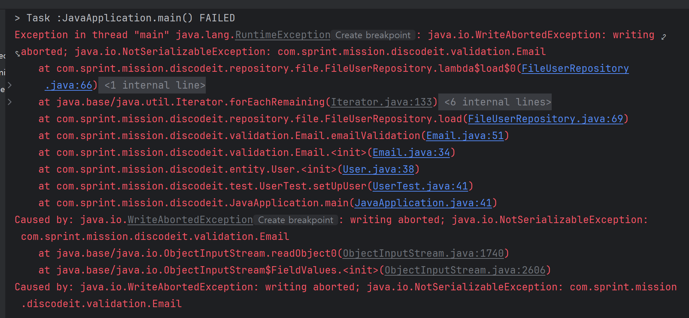
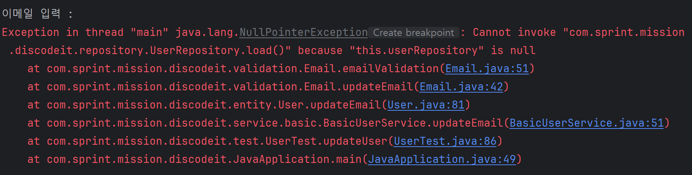
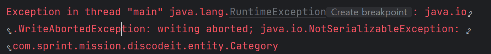

# Spring 백엔드 트랙 1기 스프린트 미션 제출 리포지토리

---

## 디스코드 분석

---

- 디스코드 구조 : 서버 > **카테고리** > **채널** > **스레드(메시지)**
- 카테고리명과 채널명은 중복 가능 (UUID를 통해 구분되는 것으로 추정)
- 서버 생성 시 채팅 채널과 음성 채널 카테고리, 일반 채널이 기본적으로 만들어짐
- 채널 생성 시 기본적으로 카테고리 설정되지 않음
  - 카테고리 설정 위해서는 채널을 생성한 뒤 원하는 카테고리로 변경해야 함

<br>

## 스프린트 미션 진행 현황

---

### 스프린트 미션 1
1. **프로젝트 초기화**
   - JDK 17 사용
   - Build System: Gradle-Groovy
2. **도메인 모델링(Entity)**
   1. 도메인 모델 정의
      1. User
         - pk, 생성 일자, 변경 일자, 이메일(아이디), 비밀번호, 이름, 닉네임, 전화번호
      2. Channel
         - pk, 생성 일자, 변경 일자, 채널 주인 pk, 채널 카테고리, 채널 이름, 채널 설명, 멤버 목록
      3. Message
         - pk, 생성 일자, 변경 일자, 채널 pk, 작성자 pk, 메시지 내용
   2. 생성자를 통해 각 필드 초기화
   3. getter, update 함수 정의
3. **서비스 설계 및 구현**
   1. 인터페이스 작성
   2. 인터페이스 구현체 작성 (JCF*Service)
      - Collection 프레임워크를 DB 대체로 사용
      - Map<UUID, 각 entity 타입> data = new HashMap<>();
        - 주로 검색 용도이고, 삭제가 잦지 않으므로 HashMap 사용
      - data 공유를 위해 싱글톤 패턴으로 작성
4. Main 클래스에서 각 메서드 테스트

---

### 스프린트 미션 2
1. **File IO를 통한 데이터 영속화**
   1. 인터페이스 작성
   2. 인터페이스 구현체 작성 (File*Service)
      - 객체 직렬화를 통해 파일로 객체 저장
      - 객체 역직렬화를 통해 파일에 저장된 객체 불러옴
2. **서비스 구현체 분석**
   - JCF*Service의 경우 Collection 프레임워크를 통해 데이터를 저장하고 불러옴
   - File*Service의 경우 직렬화/역직렬화를 통해 데이터를 저장하고 불러옴
3. **레포지토리 설계 및 구현**
   1. 인터페이스 작성
   2. 인터페이스 구현체 작성 
      1. JCF*Repository
         - Map<UUID, *> data
         - data에 데이터 저장/불러오기/삭제 메서드 작성
      2. File*Repository
         - 파일에 데이터 저장/불러오기/삭제 메서드 작성
4. **service의 저장 로직을 repository로 대체**
5. **관심사 분리를 통한 레이어 간 의존성 주입**
   - basic 패키지에 Basic*Service 만듦
   - Service의 비즈니스 로직 작성
         
### 수정사항

1. **유효성 검사 수정**
   - 기존 코드는 service에 책임이 치중되어 있었음
     - 문제점: 중복코드 과다, 절차지향적 코딩
   - 유효성 검사에 대한 책임을 각 entity에 넘김
     - 단순 null 확인은 각 entity 클래스에 작성
     - 그 이상의 유효성 검사(정규식 등)가 필요할 경우 클래스 분리
2. **category entity 추가**
3. **의존성 주입**
   - Channel에 User에 대한 의존성 주입 (생성자 주입)
   - Category와 Message에 Channel에 대한 의존성 주입 (생성자 주입)
   - 각 Service단에 Repository에 대한 의존성 주입 (생성자 주입)
4. **일급 컬렉션 사용**
   - data 패키지 만듦
   - UserData, ChannelData, MessageData 클래스 생성

### 트러블 슈팅

1. **FileUserService 실행 시 RuntimeException 발생**

   

   - 현재 validation 패키지에 있는 Email 클래스의 멤버 변수인 UserRepository 인터페이스가 직렬화 불가능이라 생기는 문제로 추정
      - transient 키워드 사용 → 해결
      - transient
         - 해당 키워드가 적용된 필드는 Serialize하는 과정에서 제외됨
         - static이나 final 키워드가 붙은 경우 효과 없음

2. **UserTest 클래스의 userService.updateEmail(id, email) 실행 시 NullPointerException 발생**

   

   - 직렬화할 때 적용한 transient 키워드로 인해 역직렬화 시 userService가 null로 초기화되어 발생한 문제로 추정
      - readObject 메서드 사용
         - 역직렬화 시 자동으로 호출됨
         - 반드시 private으로 선언해야 함

          ```java
          private void readObject(ObjectInputStream ois) throws IOException, ClassNotFoundException {
                  // 역직렬화 실행
                  ois.defaultReadObject();
                  
                  // 역직렬화 실행 후 수행되는 로직
                  this.userRepository = new FileUserRepository();
              }
          ```


3. **Category 클래스에서 NotSerializableException으로 인한 RuntimeException 발생**

   

   - Category 클래스를 Serializable 구현체로 만듦

4. git push가 안되는 문제 발생

    ```bash
    tjdwl@notebook MINGW64 /c/Source/1-sprint-mission (part1-한성지-sprint2)
    $ git push origin part1-한성지-sprint2
    To github.com:hyanyul/1-sprint-mission.git
     ! [rejected]        part1-한성지-sprint2 -> part1-한성지-sprint2 (fetch first)
    error: failed to push some refs to 'github.com:hyanyul/1-sprint-mission.git'
    hint: Updates were rejected because the remote contains work that you do not
    hint: have locally. This is usually caused by another repository pushing to
    hint: the same ref. If you want to integrate the remote changes, use
    hint: 'git pull' before pushing again.
    hint: See the 'Note about fast-forwards' in 'git push --help' for details.
    
    ```

   - 로컬 브랜치가 원격 브랜치보다 뒤처져서 발생한 문제
   - `git pull origin [해당 로컬 브랜치]`로 원격 브랜치를 당겨온 뒤, 코드를 고치고 다시 push하여 해결

5. commit 메시지를 잘못 작성하는 문제 발생
   - `git commit --amend -m "변경할 커밋 메시지”` 한 뒤 `git push --force origin [커밋할 브랜치]` 로 강제로 push하여 해결
   - 이 방법으로 가장 최근 커밋한 커밋 메시지 변경 가능
   - `push —force`의 경우 강제로 push하는 것이므로 협업 시 동료와의 의논 필수

### 추후 수정할 부분

1. 방어적 복사와 깊은 복사를 통해 불변 객체 만들기
2. display 관련 메서드 사용 시 너무 많은 매개 변수 필요 → 매개변수 줄이기
   > 참고: [[클린코드] 매개변수 개수](https://lordofkangs.tistory.com/196)
3. JUnit을 활용한 테스트 코드 작성