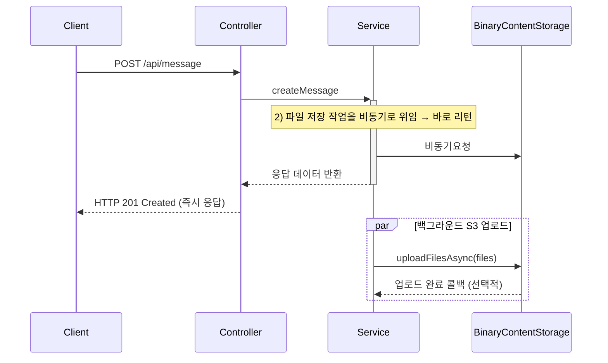
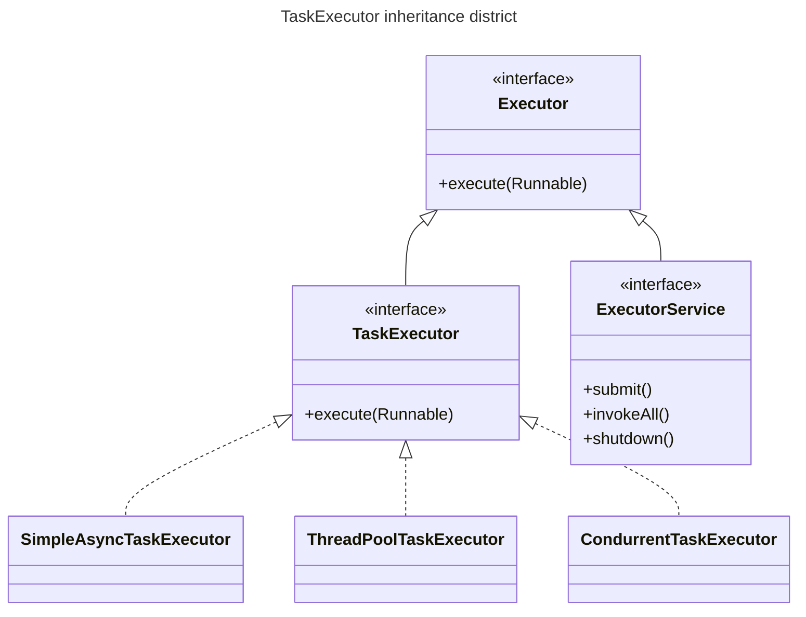

# 0-spring-mission

스프린트 미션 모범 답안 리포지토리입니다.

[](https://codecov.io/gh/codeit-bootcamp-spring/0-sprint-mission)

## sprint 11 mission

### project milestone

- 비동기를 통해 응답 속도 향상하기
- 캐시를 통해 DB I/O 줄이기
- `Kafka` 도입하기
- `Redis` 도입하기

## 1. 비동기 처리하기

### 파일 업로드 로직을 비동기 처리하기

현재 put (파일 업로드) 메소드를 사용하고 있는곳

1. BasicBinaryContentService.create (반환값 사용 X)
2. BasicMessageService create (반환값 사용 X)
3. BasicUserService create (반환값 사용 X)
4. BasicUserService update (반환값 사용 X)

> 반환값을 사용하지 않는 이유는 파라미터로 들어온 Binary Entity ID를 그대로 반환하고 있기 때문에.

### Message Service

**Message Controller** 의 create, `POST /api/message`   
`Request` -> `Controller` -> `Service` -> `Repository`

1. DB Channel 조회
2. DB User 조회
3. DB에 BinaryContent 저장
4. S3에 파일 저장 : 여러 파일 가능

이 중 DB에 메타데이터를 저장 후, 생성된 UUID 를 S3 Key 값으로 저장을 하는데, **동기처리에서 비동기 처리로 변경**합니다.


```mermaid
sequenceDiagram
participant Client
    Client->>Controller: POST /api/message 
    Controller->>+Service: createMessage

    Note over Service: 2) 파일 저장 작업을 비동기로 위임 → 바로 리턴

    Service->>BinaryContentStorage: 비동기요청
    Service-->>-Controller: 응답 데이터 반환
    Controller-->>Client: HTTP 201 Created (즉시 응답)

    par 백그라운드 S3 업로드
        Service->>BinaryContentStorage: uploadFilesAsync(files)
        BinaryContentStorage-->>Service: 업로드 완료 콜백 (선택적)
    end

```

## 비동기 처리를 위한 Config


```mermaid
---
title: TaskExecutor inheritance district
---
classDiagram
	Executor<|--TaskExecutor
	Executor<|--ExecutorService
	TaskExecutor<|..SimpleAsyncTaskExecutor
	TaskExecutor<|..ThreadPoolTaskExecutor
	TaskExecutor<|..CondurrentTaskExecutor
	class Executor{
	    <<interface>>
	    +execute(Runnable)
	}
	class TaskExecutor {
			<<interface>>
			+execute(Runnable)
	}
	class ExecutorService {
			<<interface>>
			+submit()
			+invokeAll()
			+shutdown()
	}
	class SimpleAsyncTaskExecutor {
	}
	class ThreadPoolTaskExecutor {
	}
	class CondurrentTaskExecutor {
	}
```

스프링 비동기 처리를 위한 config 설정

```java

@Configuration
@EnableAsync
public class AsyncConfig {

}
```


