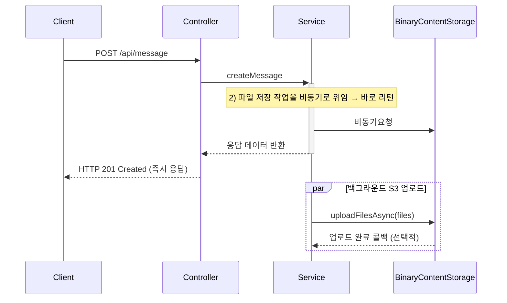
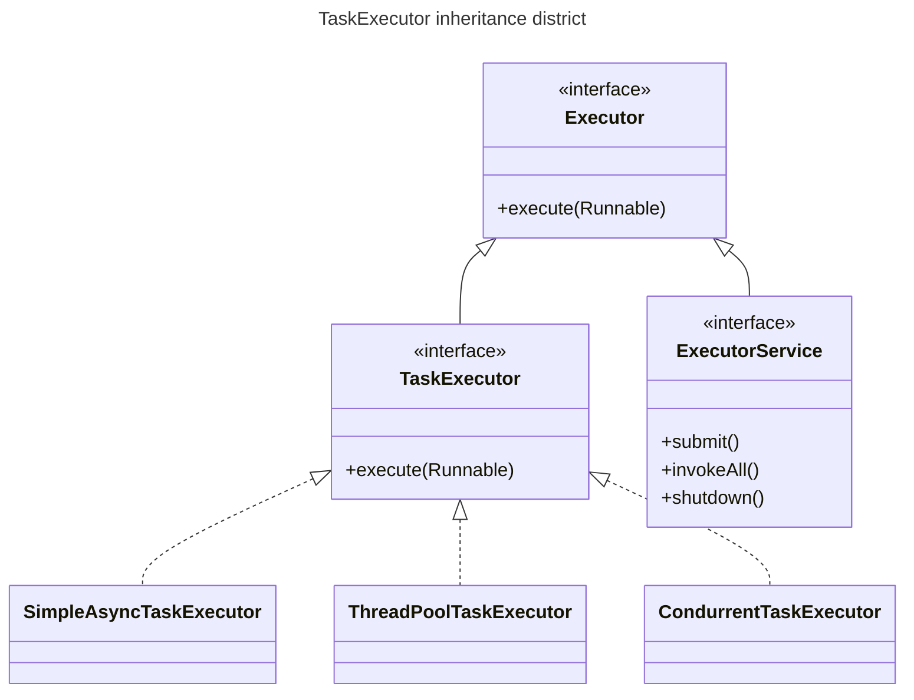
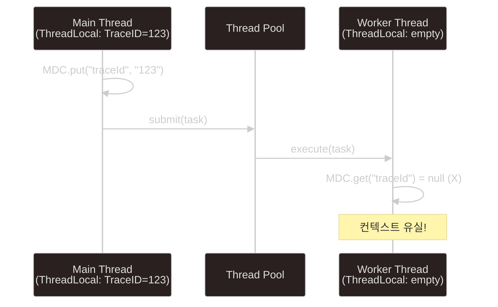
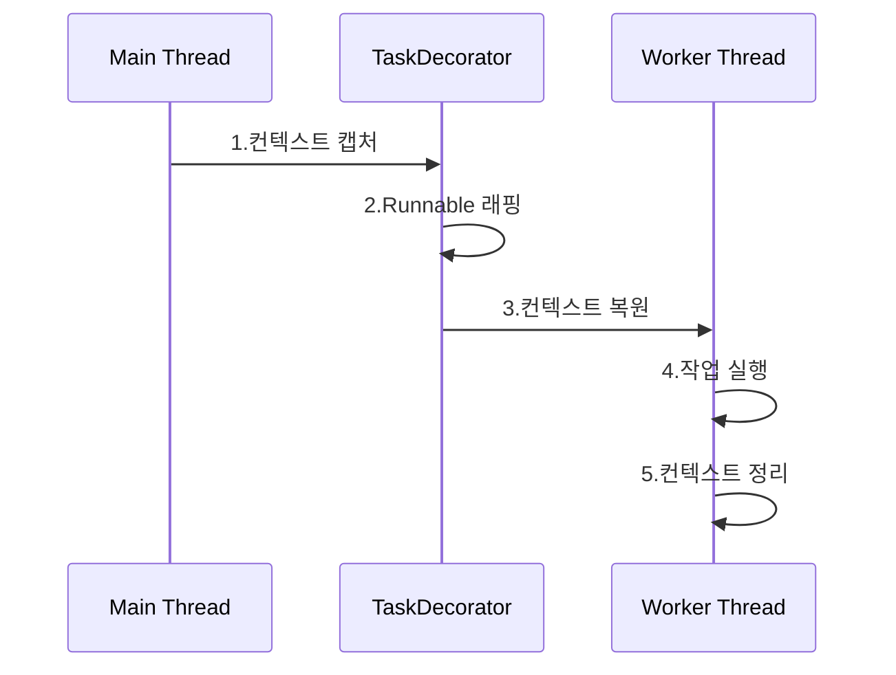
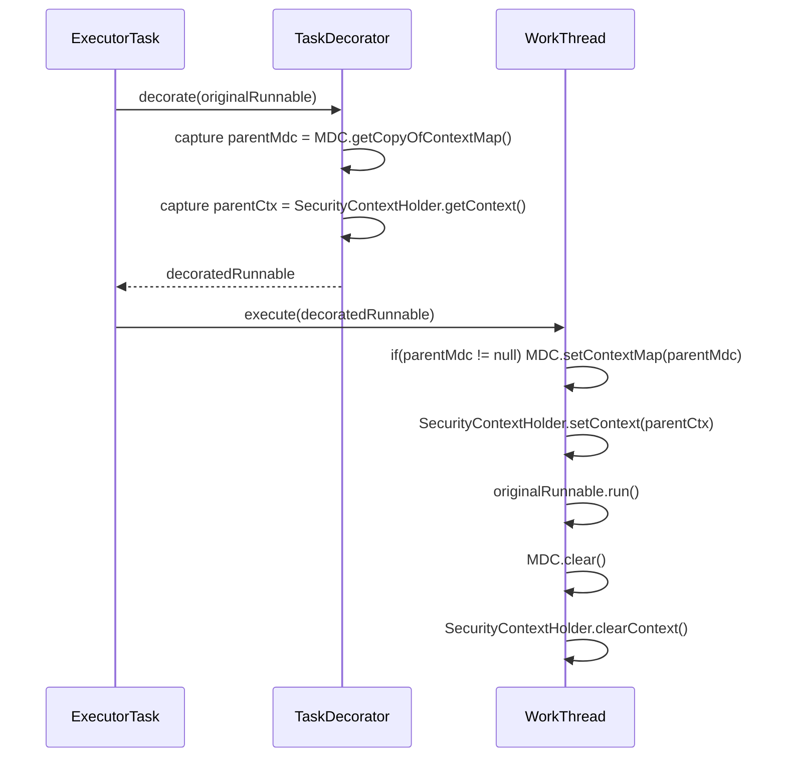
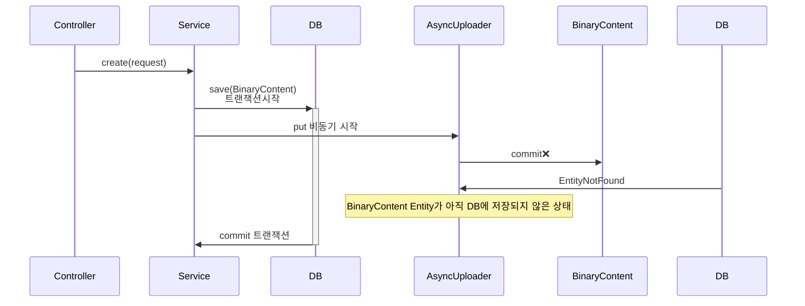
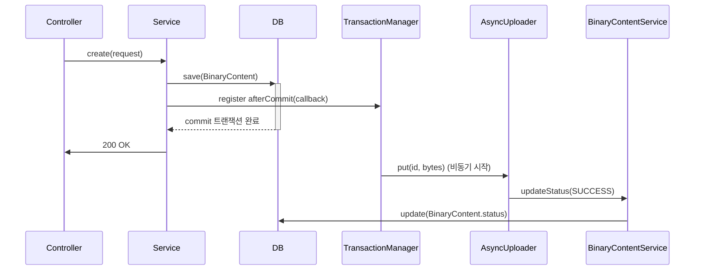

# 0-spring-mission

스프린트 미션 모범 답안 리포지토리입니다.

[](https://codecov.io/gh/codeit-bootcamp-spring/0-sprint-mission)

## sprint 11 mission

### project milestone

- 비동기를 통해 응답 속도 향상하기
- 캐시를 통해 DB I/O 줄이기
- `Kafka` 도입하기
- `Redis` 도입하기

## 1. 비동기 처리하기

### 파일 업로드 로직을 비동기 처리하기

현재 put (파일 업로드) 메소드를 사용하고 있는곳

1. BasicBinaryContentService.create (반환값 사용 X)
2. BasicMessageService create (반환값 사용 X)
3. BasicUserService create (반환값 사용 X)
4. BasicUserService update (반환값 사용 X)

> 반환값을 사용하지 않는 이유는 파라미터로 들어온 Binary Entity ID를 그대로 반환하고 있기 때문에.

### Message Service

**Message Controller** 의 create, `POST /api/message`   
`Request` -> `Controller` -> `Service` -> `Repository`

1. DB Channel 조회
2. DB User 조회
3. DB에 BinaryContent 저장
4. S3에 파일 저장 : 여러 파일 가능

이 중 DB에 메타데이터를 저장 후, 생성된 UUID 를 S3 Key 값으로 저장을 하는데, **동기처리에서 비동기 처리로 변경**합니다.


```mermaid
sequenceDiagram
participant Client
    Client->>Controller: POST /api/message 
    Controller->>+Service: createMessage

    Note over Service: 2) 파일 저장 작업을 비동기로 위임 → 바로 리턴

    Service->>BinaryContentStorage: 비동기요청
    Service-->>-Controller: 응답 데이터 반환
    Controller-->>Client: HTTP 201 Created (즉시 응답)

    par 백그라운드 S3 업로드
        Service->>BinaryContentStorage: uploadFilesAsync(files)
        BinaryContentStorage-->>Service: 업로드 완료 콜백 (선택적)
    end

```

## 비동기 처리를 위한 Config


```mermaid
---
title: TaskExecutor inheritance district
---
classDiagram
	Executor<|--TaskExecutor
	Executor<|--ExecutorService
	TaskExecutor<|..SimpleAsyncTaskExecutor
	TaskExecutor<|..ThreadPoolTaskExecutor
	TaskExecutor<|..CondurrentTaskExecutor
	class Executor{
	    <<interface>>
	    +execute(Runnable)
	}
	class TaskExecutor {
			<<interface>>
			+execute(Runnable)
	}
	class ExecutorService {
			<<interface>>
			+submit()
			+invokeAll()
			+shutdown()
	}
	class SimpleAsyncTaskExecutor {
	}
	class ThreadPoolTaskExecutor {
	}
	class CondurrentTaskExecutor {
	}
```

스프링 비동기 처리를 위한 config 설정

```java

@Configuration
@EnableAsync
public class AsyncConfig {

}
```

[AsyncConfigurer 를 구현해야하는 이유]()

## ThreadLocal 의 특성 상 비동기 처리를 하는 스레드에서의 컨텍스트 유실


```mermaid
---
config:
  theme: neo-dark
---
sequenceDiagram
    participant M as Main Thread<br/>(ThreadLocal: TraceID=123)
    participant P as Thread Pool
    participant W as Worker Thread<br/>(ThreadLocal: empty)

    M->>M: MDC.put("traceId", "123")
    M->>P: submit(task)
    P->>W: execute(task)
    W->>W: MDC.get("traceId") = null (X)
    Note over W: 컨텍스트 유실!
```

`@Async` 등으로 비동기 스레드에서 작업을 수행할 때

1. slf4j MDC 정보
2. 스프링 시큐리티 컨텍스트
   는 기본적으로 부모 스레드에 저장된 ThreadLocal 에만 남아있으며, 비동기로 실행되는 새로운 스레드에서는 비어있거나 디폴트가 된다.

```text
25-06-05 13:29:37.398 [http-nio-8080-exec-7] INFO  c.s.m.d.controller.UserController    [177a46c782894ca3ab956ca118d3fbbe | POST | /api/users] - 사용자 생성 요청: UserCreateRequest[username=test, email=test@mail.com, password=qorwodn1!]
25-06-05 13:29:37.432 [io-AsyncExecutor-1] INFO  c.s.m.d.s.l.LocalBinaryContentStorage [ |  | ] - Local 파일 업로드 성공: .discodeit\storage\d52f55d0-c341-418d-abc4-bf04e1af6573
```

이 문제를 해결하기 위해서 TaskDecorator 패턴을 사용한다.


```mermaid
sequenceDiagram
    participant M as Main Thread
    participant T as TaskDecorator
    participant W as Worker Thread
    M->>T:1.컨텍스트 캡처
    T->>T:2.Runnable 래핑
    T->>W:3.컨텍스트 복원
    W->>W:4.작업 실행
    W->>W:5.컨텍스트 정리
```

`package com.sprint.mission.discodeit.ContextPropagatingTaskDecorator` 참고


```mermaid
sequenceDiagram
  participant P1 as ExecutorTask
  participant P2 as TaskDecorator
  participant P3 as WorkThread

  %% 1) Executor가 데코레이터에 원본 Runnable을 전달
  P1 ->> P2: decorate(originalRunnable)

  %% 2) 데코레이터 내부에서 부모 쓰레드의 MDC/보안 컨텍스트를 캡처
  P2 ->> P2: capture parentMdc = MDC.getCopyOfContextMap()
  P2 ->> P2: capture parentCtx = SecurityContextHolder.getContext()

  %% 3) 데코레이터가 “부모 콘텍스트를 주입하는 로직을 추가한 래핑 Runnable” 반환
  P2 -->> P1: decoratedRunnable

  %% 4) Executor는 데코레이터가 반환한 래핑 Runnable을 스레드 풀에 제출
  P1 ->> P3: execute(decoratedRunnable)

  %% 5) WorkThread(풀 내부 쓰레드)에서 실행 직전에 MDC/보안 컨텍스트를 설정
  P3 ->> P3: if(parentMdc != null) MDC.setContextMap(parentMdc)
  P3 ->> P3: SecurityContextHolder.setContext(parentCtx)

  %% 6) WorkThread에서 실제 비즈니스 로직(run()) 수행
  P3 ->> P3: originalRunnable.run()

  %% 7) 실행 완료 후 MDC와 SecurityContext를 클리어
  P3 ->> P3: MDC.clear()
  P3 ->> P3: SecurityContextHolder.clearContext()
```

결과

```text
25-06-05 14:19:38.517 [http-nio-8080-exec-1] INFO  c.s.m.d.controller.UserController    [3022e9ac844a4b6599d233bf17304af9 | POST | /api/users] - 사용자 생성 요청: UserCreateRequest[username=test, email=test@mail.com, password=qorwodn1!]
25-06-05 14:19:38.547 [io-AsyncExecutor-1] INFO  c.s.m.d.s.l.LocalBinaryContentStorage [3022e9ac844a4b6599d233bf17304af9 | POST | /api/users] - Local 파일 업로드 성공: .discodeit\storage\bb2330ff-e4fe-459f-863d-b3dad835c39f
```

복원에 성공한 것을 확인할 수 있다.

## 비동기 예외 처리

업로드 중 예외가 발생한 경우, 자동 재시도 매커니즘을 구현

- Spring Retry의 `@Retryable` 어노테이션을 사용해 재시도 정책

## upload 로직


```mermaid
sequenceDiagram
  participant C as Controller
  participant S as Service
  participant D as DB
  participant AsyncUploader
  participant BinaryContent

  C->>S: create(request)
  S->>+D: save(BinaryContent)<br/>트랜잭션시작
  S->>AsyncUploader: put 비동기 시작
  AsyncUploader->>BinaryContent: commit❌
  DB->>AsyncUploader: EntityNotFound
  Note over AsyncUploader: BinaryContent Entity가 아직 DB에 저장되지 않은 상태
  D->>-S: commit 트랜잭션
```

비동기로 업로드를 시작하는데, 이때 BinaryContent Entity가 아직 DB에 저장되지 않은 상태에서 업로드를 시도하면, EntityNotFound 예외가 발생한다.
이를 해결하기 위해, 트랜잭션이 커밋이 완료된 후 비동기 업로드를 시작하도록 변경한다.


```mermaid
sequenceDiagram
    participant Controller
    participant Service
    participant DB
    participant TransactionManager
    participant AsyncUploader
    participant BinaryContentService

    Controller->>Service: create(request)
    Service->>+DB: save(BinaryContent)
    Service->>TransactionManager: register afterCommit(callback)
    DB-->>-Service: commit 트랜잭션 완료
    Service->>Controller: 200 OK

    TransactionManager->>AsyncUploader: put(id, bytes) (비동기 시작)
    AsyncUploader->>BinaryContentService: updateStatus(SUCCESS)
    BinaryContentService->>DB: update(BinaryContent.status)
    
```

비동기 처리 결과를 기다리지 않고 트랜잭션을 완료한 후에 요청에 대한 응답을 반환한다.   
이후 비동기 업로드가 완료되면, BinaryContentService를 통해 DB에 상태를 업데이트한다.
