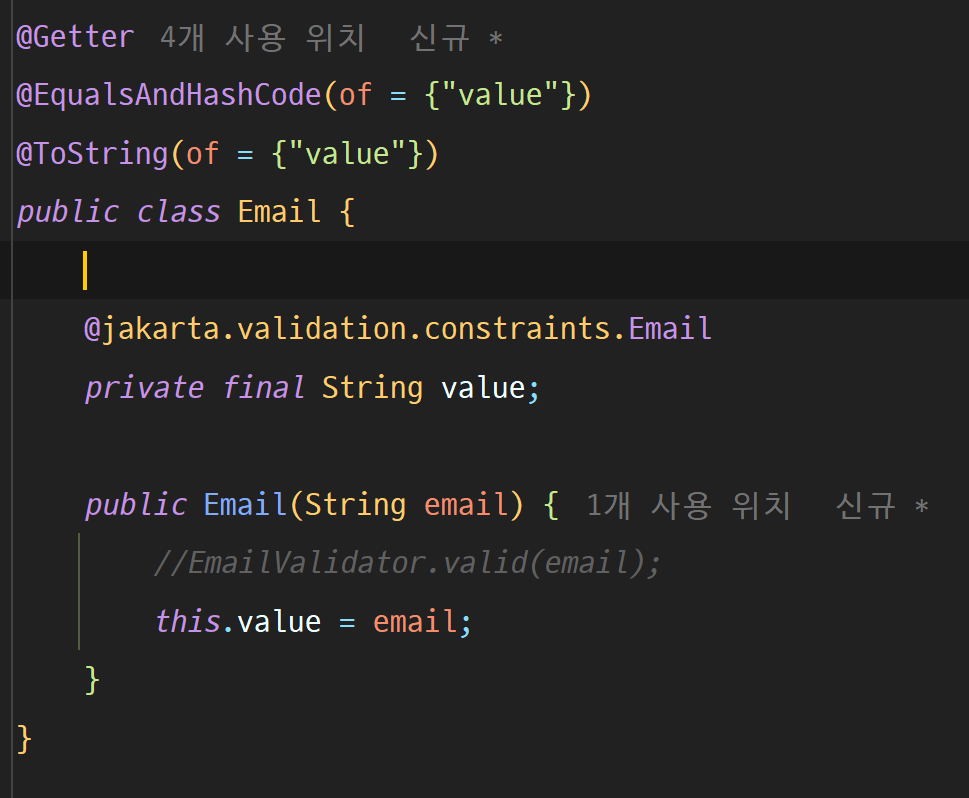
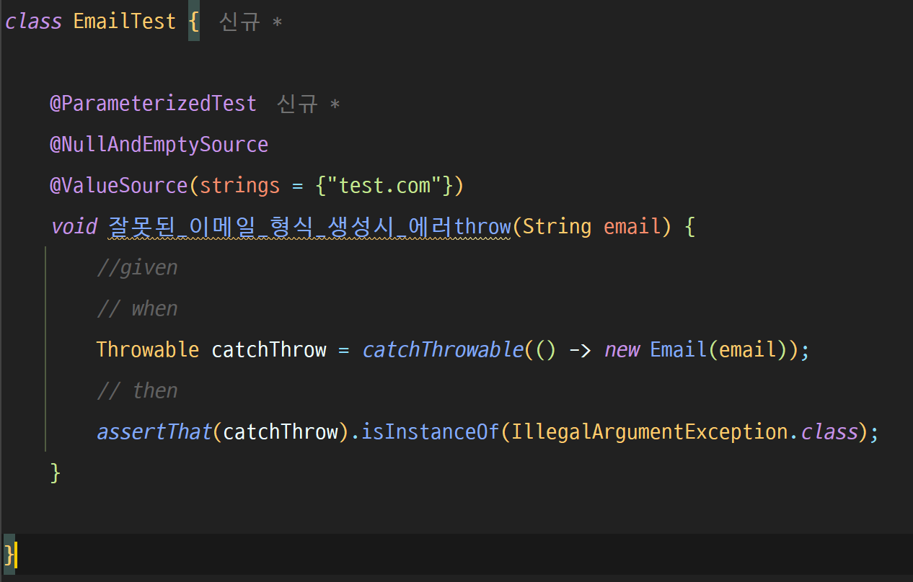

# 도메인 유효성 검증

도메인의 유효성 검증은 비즈니스 로직으로 적절히 처리되고 에러를 반환해주어야 한다.
그렇다면, 어떻게 검증하는 것이 좋을까 ?

우선, 도메인 객체와 DTO 객체의 분리를 먼저 하자. 도메인 객체에서 던지는 에러와 DTO 에서 던지는
에러를 분리해서 생각해본다는 말이다. 밀접하게 연관되어 있는 두 객체 사이의 비슷한 검증으로 인해
어떻게 만들어야 할지 헷갈리기 때문이다.

도메인 객체의 유효성 검사를 위해서 외부에 validator 담당 객체를 만들어 준다. 그리고 도메인
객체의 생성자에서 정적 메서드를 호출하여 적절한 처리를 통해 도메인의 무결성을 보장한다.

분리를 통해서 만들어지는 `검증 객체`가 많아질 수 도 있겠다고 생각한다. 공통되는 부분이 있다면
최대한 고려해서 리팩터링을 진행하는 것이 중요하다.

또한 검증객체에서 던지는 `커스텀 에러 객체` 또한 만들어주어야 한다. 이를 통해서 공통되는
에러 객체를 던지고 그 내용은 `검증 객체`에 따라서 다른 내용이 들어가게 만들어준다. 이후 던져진
에러를 잡고 적절히 반환해주기 위해 컨트롤러에서 응답객체에 적절히 담아서 사용자에게 응답한다.

## Hibernate Validator(@Valid) 사용 시 커스텀 Validator 가 필요 없는가?
hibernate 에서 제공해주는 valid 기능을 사용하게 된다면 내 도메인 객체에서 값을 검증해주는
검증 객체 또는 검증 메서드를 만들 필요가 없지 않을까라고 생각이 들었습니다.

결론은 커스텀 검증 객체가 필요합니다. 그 이유에 대해서 살펴보겠습니다.

우선 다음 코드가 테스트 실패합니다. 

    
    

### Hibernate Validator(@Valid) 는 언제 동작하는가?
Hibernate validator 가 동작하는 경우는 다음과 같습니다.
1. Spring MVC에서 요청 바인딩 시 (@Valid 사용)
2. JPA 엔티티로 저장할 때 유효성 검사를 실행할 때
3. 명시적으로 Hibernate Validator를 호출할 때

즉, 엔티티 도메인 객체 생성자에서 `new Test("123")` 처럼 직접 객체를 만드는 과정에서는
검증이 되지 않습니다. 왜냐하면 `@Email` 검증이 동작하지 않기 때문입니다. 

 

| 상황 | Hibernate Validator(@Valid) 자동 실행 여부 |
|------|--------------------------------|
| **Spring 컨트롤러에서 `@Valid` 사용** | ✅ 자동 실행됨 |
| **JPA에서 `persist()` 또는 `update()` 호출 시** | ✅ 자동 실행됨 (단, `@PrePersist`, `@PreUpdate` 필요) |
| **`new Test("123")`로 직접 객체 생성** | ❌ 자동 실행되지 않음 |

### 엔티티 도메인 객체에 필요할까?
또 한가지 생각해볼것이 있습니다. Validator 기능을 통해서 검증을 실행하면 되는 것이 아닌가요.
왜 도메인 커스텀 검증 객체를 만들어야 하는지 이유는 무엇일까요?

JPA의 기능으로 데이터베이스에 저장할 때 검증을 하게 된다면 영속성 컨텍스트에서 검증 후
DB 요청을 하기 때문에 별다른 검증을 진행하지 않아도 되지 않을까 생각이 듭니다. 만약 JPA를
지원하지 않는 데이터베이스로 변경하게 된다면 정상적으로 검증이 실행되지 않을 것입니다. 그렇다면
수동으로 Hibernate Validator 를 실행시켜야 하는데, 코드가 매우 지저분해질 것입니다. 

이러한 이유 때문에 값을 검증하는 로직을 관리하는 객체를 만들고 검증을 실행해야 한다고 생각합니다.
