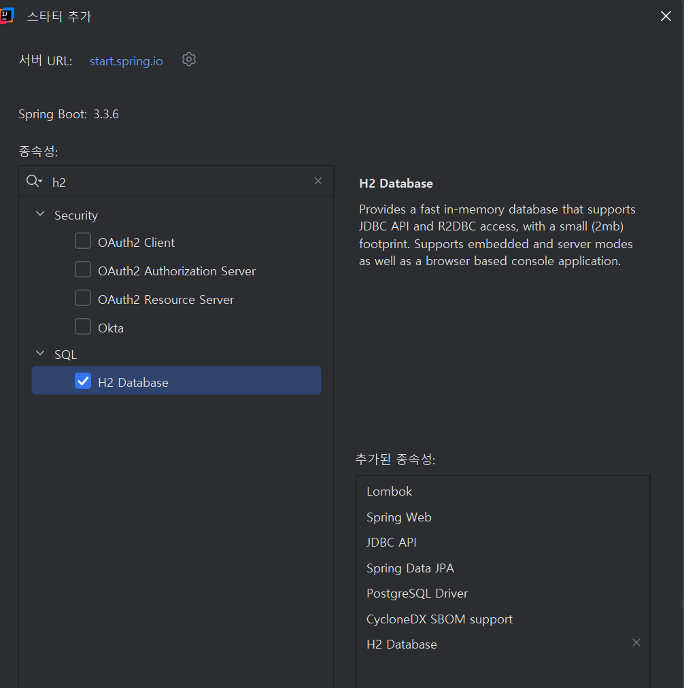
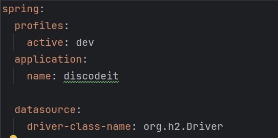
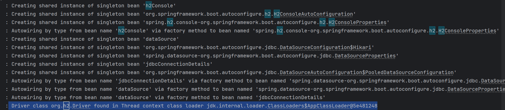
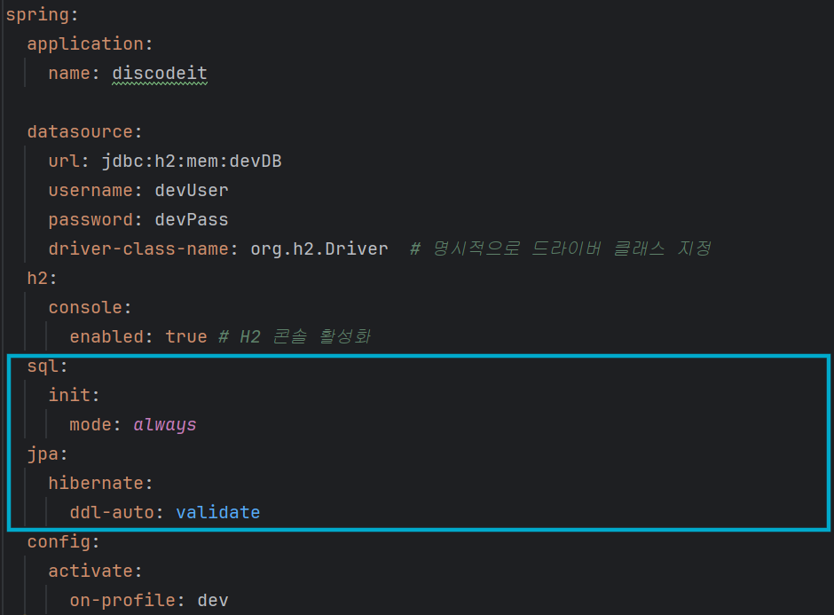

문제 상황 :

    Caused by: org.springframework.beans.factory.UnsatisfiedDependencyException: Error creating bean
    with name 'dataSourceScriptDatabaseInitializer' defined in class path
    resource [org/springframework/boot/autoconfigure/sql/init/DataSourceInitializationConfiguration.class]:
    Unsatisfied dependency expressed through method 'dataSourceScriptDatabaseInitializer' parameter 0:
    Error creating bean with name 'dataSource' defined in class path
    resource [org/springframework/boot/autoconfigure/jdbc/DataSourceConfiguration$Hikari.class]: Failed
    to instantiate [com.zaxxer.hikari.HikariDataSource]: Factory method 'dataSource' threw exception
    with message: Failed to load driver class org.h2.Driver in either of HikariConfig class loader or
    Thread context classloader

Caused by: org.springframework.beans.factory.UnsatisfiedDependencyException: Error creating bean
with name 'dataSourceScriptDatabaseInitializer' defined in class path

클래스 경로에 'dataSourceScriptDatabaseInitializer'라는 이름으로 정의된 빈을 생성할 수 없는 오류가 발생했다.
UnsatisfiedDependencyException = 불만족스러운 종속성 예외

Failed to load driver class org.h2.Driver in either of HikariConfig class loader or
Thread context classloader
H2 드라이버(org.h2.Driver)를 로드할 수 없다.

해결 : 의존성 추가, 설정 파일에 설정 추가

1. 의존성 추가
   

새로운 의존성을 추가한 후 다운로드할 수 있게 build.gradle 을 통해 org.h2.Driver 클래스가 인식되도록 했다.

2. yml 설정 파일에 설정 추가
   

공통 설정 파일에 spring:profiles:active: dev, datasource:driver-class-name: org.h2.Driver 를 설정했다.

-----

문제 상황2 :

      2025-03-27T16:14:02.827+09:00 ERROR 18156 --- [discodeit] [           main]
      j.LocalContainerEntityManagerFactoryBean : Failed to initialize JPA
      EntityManagerFactory: [PersistenceUnit: default] Unable to build Hibernate SessionFactory; nested
      exception is org.hibernate.tool.schema.spi.SchemaManagementException: Schema-validation: missing
      table [message]
      2025-03-27T16:14:02.830+09:00 WARN 18156 --- [discodeit] [           main]
      ConfigServletWebServerApplicationContext : Exception encountered during context initialization -
      cancelling refresh attempt: org.springframework.beans.factory.BeanCreationException: Error creating
      bean with name 'entityManagerFactory' defined in class path
      resource [org/springframework/boot/autoconfigure/orm/jpa/HibernateJpaConfiguration.class]: [PersistenceUnit: default]
      Unable to build Hibernate SessionFactory; nested exception is
      org.hibernate.tool.schema.spi.SchemaManagementException: Schema-validation: missing table [message]

Schema-validation: missing table [message]
스키마 검증 단계에서 message 라는 테이블이 없어서 발생한 문제이다.

해결 : H2 DB에 테이블 생성

DB에 message 테이블이 없거나, 아예 테이블을 생성하는 SQL(schema.sql)이 실행되지 않았거나 둘 중 하나라고 생각했다.
때문에 H2 DB에 데이터테이블을 생성하는 방법을 찾자, 두 가지 방법이 나왔다.

1. 스프링 부트의 DB 테이블 만들기
    - spring.sql.init.mode 사용
2. 하이버네이트가 테이블을 자동 생성해주기
    - jpa:hibernate:ddl-auto : 를 create, update 로 지정

이때, 이 두가지 설정을 동시에 이용하면 안 된다. 스프링 부트에서 테이블을 생성하려고 하는 동작과 하이버네이트가 자동 테이블을 자동 생성하려는 동작에 충돌이 있다.

실제로 jpa:hibernate:ddl-auto를 validation으로 지정한 후 테이블을 생성하려고 하자, 여전히 message 테이블이 존재하지 않는다는 오류가 동일하게
떴다.
이후 jpa:hibernate:ddl-auto를 none으로 설정하자, 애플리케이션이 실행될 수 있었다.

[[Spring Boot] DB Schema 및 Data 초기화 schema.sql data.sql
](https://chaewsscode.tistory.com/174)
[[Spring] org.springframework.beans.factory.UnsatisfiedDependencyException 에러](https://yn98.tistory.com/84#%EC%A3%BC%EC%9A%94%20%EC%9B%90%EC%9D%B8-1)
[SQL 데이터베이스](https://docs.spring.io/spring-boot/reference/data/sql.html#data.sql.h2-web-console)