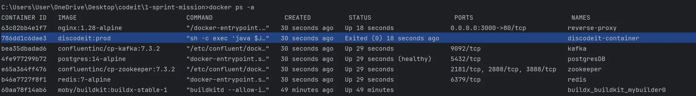
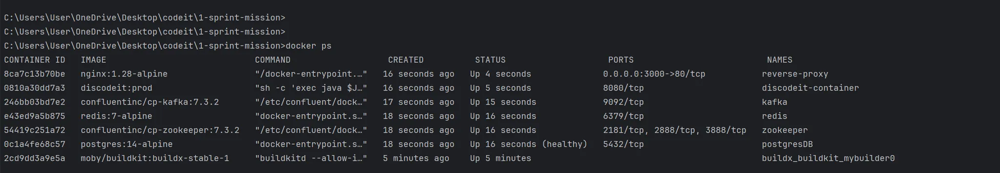

**상황**

앞서 1~4 과정을 거쳤음에도 불구하고, Docker는 켜지지 않았다. 여전히 웹 애플리케이션은 정상 종료가 되고 있었다.

**문제가 일어난 이유 :** Docker File 에 작성된 최종 명령어의 문법 문제

“백엔드 애플리케이션이 Exited(0) 으로 종료” 라는 키워드로 검색해, 블로그 글을 확인했다.

> docker container는 하나의 명령어를 실행합니다. 명령어의 수행이 끝나면 종료(exit code 0)합니다. 따라서, 명령어를 주지 않거나 단발적으로 실행되고 끝나는
> 명령어를 주면 컨테이너가 곧바로 종료되고, 정상적인 종료임으로 code 0을 반환하며 종료됩니다.
>
>
> https://amkorousagi-money.tistory.com/entry/docker-compose-%EC%8B%9C-exited-with-code-0-%EB%98%90%EB%8A%94-%EB%AC%B4%ED%95%9C-%EC%9E%AC%EC%8B%9C%EC%9E%91
>

컨테이너를 강제로 열어두고(블랙홀 코드), 수동으로 웹 애플리케이션을 실행시킬 때 `java -jar app.jar` 명령어를 이용했다. 실제로 이렇게 실행시킬 때는 문제가 되지
않았던 것을 떠올렸다.

**문제 해결** : Docker File에 작성된 CMD 코드 변경

`CMD ["sh", "-c", "exec", "java $JVM_OPTS -jar app.jar"]` →
`CMD ["sh", "-c", "exec java $JVM_OPTS -jar app.jar"]`

`CMD ["sh", "-c", "exec", "java $JVM_OPTS -jar app.jar"]`

이 명령어에는 문법적 오류가 있다. “sh”, “-c” 뒤에는 하나의 문자열이 와야한다.

1. Shell 프로세스 실행
2. Shell는 문법상 `exec` 만 명령어로 인식한다.

제대로 작동하는 모습이다…

---

**`$JVM_OPTS` 같은 옵션을 통해** 컨테이너 환경에서 각 컨테이너가 사용할 수 있는 메모리가 제한되어 있으므로, JVM에게 알려줄 수 있다.

e.g. 자바(JVM)가 사용하는 힙 메모리의 최소값과 최대값 설정 : `-Xms256m -Xmx512m`

JVM이 시작할 때 최소 256MB, JVM이 사용할 수 있는 최대 힙 메모리는 512MD까지로 확보하겠다는 뜻이다.