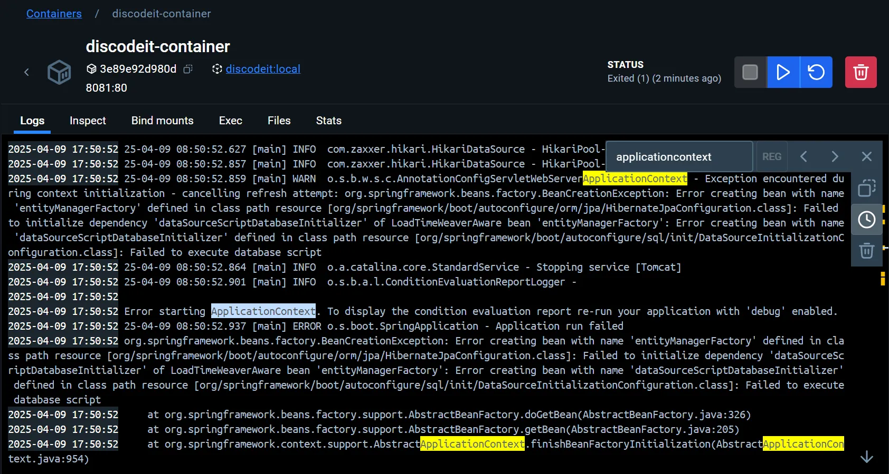
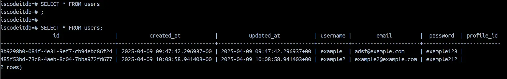

**문제**


```yaml
2025-04-09 17:50:52 25-04-09 08:50:52.859 [main] WARN  o.s.b.w.s.c.AnnotationConfigServletWebServerApplicationContext - Exception encountered during context initialization - cancelling refresh attempt:
  org.springframework.beans.factory.BeanCreationException:
    Error creating bean with name 'entityManagerFactory' defined in class path resource [org/springframework/boot/autoconfigure/orm/jpa/HibernateJpaConfiguration.class]:
      Failed to initialize dependency 'dataSourceScriptDatabaseInitializer' of LoadTimeWeaverAware bean 'entityManagerFactory':
        Error creating bean with name 'dataSourceScriptDatabaseInitializer' defined in class path resource [org/springframework/boot/autoconfigure/sql/init/DataSourceInitializationConfiguration.class]: Failed to execute database script
  2025-04-09 17:50:52 25-04-09 08:50:52.864 [main] INFO  o.a.catalina.core.StandardService - Stopping service [Tomcat]
  2025-04-09 17:50:52 25-04-09 08:50:52.901 [main] INFO  o.s.b.a.l.ConditionEvaluationReportLogger -
  2025-04-09 17:50:52
  2025-04-09 17:50:52 Error starting ApplicationContext. To display the condition evaluation report re-run your application with 'debug' enabled.
  2025-04-09 17:50:52 25-04-09 08:50:52.937 [main] ERROR o.s.boot.SpringApplication - Application run failed
2025-04-09 17:50:52 org.springframework.beans.factory.BeanCreationException:
  Error creating bean with name 'entityManagerFactory' defined in class path resource [org/springframework/boot/autoconfigure/orm/jpa/HibernateJpaConfiguration.class]:
    Failed to initialize dependency 'dataSourceScriptDatabaseInitializer' of LoadTimeWeaverAware bean 'entityManagerFactory':
      Error creating bean with name 'dataSourceScriptDatabaseInitializer' defined in class path resource [org/springframework/boot/autoconfigure/sql/init/DataSourceInitializationConfiguration.class]: Failed to execute database script
```

Docker 컨테이너에서 애플리케이션을 실행할 때 데이터베이스 초기화 스크립트 실행에 실패하면서 ApplicationContext 초기화에 실패(Error starting
ApplicationContex)했다.

즉, Spring Boot 가 실행 시 데이터베이스 초기화를 위해 실행하는 SQL 스크립트에서 에러가 발생했기 때문에 `entityManagerFactory` 를 생성하지 못해
애플리케이션 자체의 실행이 불가능해진 상황이다.

**문제가 일어나는 이유**

<aside>

- 처음에는 `SPRING_PROFILES_ACTIVE=prod` 를 docker-compose.yml 에 설정해주지 않아서 그런가 생각했다.
- 실제로 입력해주니 다시 8081 포트의 애플리케이션이 뜨기도 했지만,
- 또 다시 생각해보니, 이제 컨테이너에서 실행되고 있는 Postgres 를 DB로서 연동할 것인데, 이런 방식을 이용하면 `application-prod.yml` 에 지정된 로컬
  DB 가 연동되는 것 아닌가? 생각했다.
    - → User 을 생성한 후, Postgres 컨테이너의 저장공간으로 지정해둔 Volume 을 확인했는데, User가 저장돼있다는 흔적이 없었다.
- 이런 상황에는 어떻게 해야하는 것인가? 어디서 문제가 발생하고 있는가?
- 중복 정의는 안 된다. 어떤 오류가 발생할지 모르니까.

</aside>

`application-prod.yml` 를 지정하지 않으면, `application.yml`  이 기본 설정값으로 설정된다. 이때, 확인해보니
`profiles:  active: test`  …로 지정되어 있었고, test 설정 파일에서는 H2 DB를 이용하고 있었다.

- application.yml

    ```yaml
    spring:
      application:
        name: discodeit
    
      profiles:
        active: test
    
      jpa:
        show-sql: true
    
      servlet:
        multipart:
          max-file-size: 10MB # 파일 하나의 최대 크기
          max-request-size: 20MB # 한 벙네 최대 업로드 가능 용량
    
    discodeit:
      storage:
        type: local
        local:
          root-path: .discodeit/storage
    
    logging:
      level:
        root: INFO
    
    management:
      endpoints:
        web:
          exposure:
            include:
              - "health"
              - "info"
              - "metrics"
              - "loggers"
      endpoint:
        health:
          show-details: "ALWAYS"
      info:
        git:
          mode: full # Git 정보를 가져올 수 있도록 설정
    
    info:
      app:
        name: Discodeit
        version: 1.7.0
        java-version: 17
        spring-boot-version: 3.4.0
    
      datasource:
        url: jdbc:h2:mem:devDB;MODE=PostgreSQL
        driver-class-name: org.h2.Driver
    
      jpa:
        ddl-auto: validate
    
      storage:
        type: local
        local:
          root-path: .discodeit/storage
    
      multipart:
        max-file-size: 10MB
        max-request-size: 20MB
    
    springdoc:
      packages-to-scan: com.sprint.mission.discodeit.controller
      default-consumes-media-type: application/json;charset=UTF-8
      default-produces-media-type: application/json;charset=UTF-8
      swagger-ui:
        path: /swagger-ui.html
        disable-swagger-default-url: true
        display-request-duration: true
        operations-sorter: alpha
    ```

**해결**

`application.yml`  에서 `profiles: active: test` 를 제거하고, `server : port : 80` 을 추가했다.

그러자 컨테이너에서 실행 중인 PostgresSQL 과 안정적으로 연결및 테이블 생성이 완료되었다.