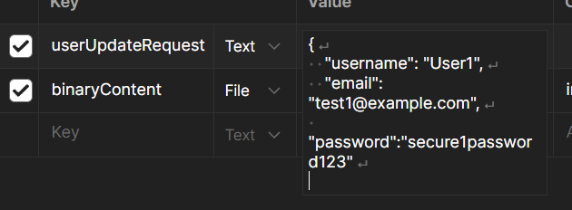

    2025-02-21T15:44:55.771+09:00  WARN 13568 --- [nio-8080-exec-7] .w.s.m.s.DefaultHandlerExceptionResolver : Resolved [org.springframework.http.converter.HttpMessageNotReadableException: JSON parse error: Unexpected end-of-input: expected close marker for Object (start marker at [Source: REDACTED (`StreamReadFeature.INCLUDE_SOURCE_IN_LOCATION` disabled); line: 1, column: 1])]'

HttpMessageConverter 쪽에서 에러를 반환했으니까, 요청 처리 과정 중 : 요청/응답 바디 <-> 객체/JSON 에서 문제가 생긴 것 같다.
실제로 알아보니 `HttpMessageNotReadableException` 는 JSON 을 파싱할 수 없을 때 일어나는 오류라고 한다.

객체가 닫히지 않은 상태에서 끝남(expected close marker for Object)?

...

Postman에서 Body 탭에서 form-data에서 } 괄호를 닫지 않아 생긴 문제였다. 정말 말 그대로 `expected close marker for Object` 였다.