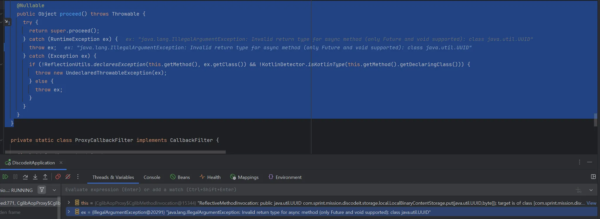
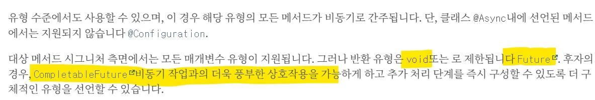
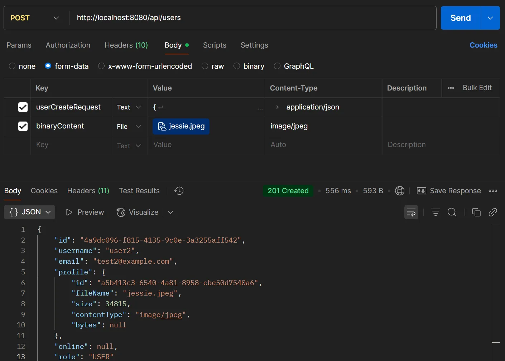

# 비동기가 작동하지 않는 문제

### 상황 : `IllegalArgumentException`발생

프로필 이미지를 포함한 회원가입 요청 시, 서버에서 400 Bad Reqeust 와 함께 `IllegalArgumentException` 오류가 발생했다.

### 문제가 일어난 이유 : @Async 메서드의 반환 타입 규칙 위반


디버깅을 따라가보니, Invalid return type for async method (only Future and void supported) : class
java.util.UUID 라는 텍스트를 반환하고 있다. *클라이언트 단에 반환될 때는 이와 같이 구체적인 메세지를 포함하고 있지 않았다

오직 void, Future 계열(CompletableFuture)만 허용하도록 되어있었고, `binaryContentStorage.put()` 은 UUID 를 반환하고 있어서
생긴 문제였다.


https://docs.spring.io/spring-framework/docs/current/javadoc-api/org/springframework/scheduling/annotation/Async.html

#### 순서

````
1. Spring의 `AOP Proxy`는 비동기 작업 실행 전 → 메서드의 시그니처 반환 타입 검사
2. 맞지 않는 반환 타입(`java.util.UUID`)을 발견하고 `IllegalArgumentException` 유효하지 않은 인자(메서드 시그니처가 맞지 않는다)로 판단하여
   에러를 던진 것이다.
3. 때문에 후의 비동기 로직을 실행하지 못했다.
````

### 해결 : 메서드 시그니처의 수정 UUID → CompletableFuture<UUID>

```java

@Retryable( // 2초, 4초, 8초 (3회)
    maxAttempts = 3,
    backoff = @Backoff(delay = 2000, multiplier = 2.0)
)
@Async
@Override
public CompletableFuture<UUID> put(UUID id, byte[] bytes) {
  log.info("파일 업로드 시작, traceId={}, fileId={}", MDC.get("traceId"), id);

  Authentication auth = SecurityContextHolder.getContext().getAuthentication();
  log.info("인증 정보 : {}", auth.getName());

  // 파일 저장 경로 지정
  Path filePath = resolvePath(id);
  File file = filePath.toFile(); // Path 객체 -> File 객체

  // 파일 저장 로직
  try (FileOutputStream fileOutputStream = new FileOutputStream(file)) {
    fileOutputStream.write(bytes);
    fileOutputStream.flush(); // flush() [스트림 강제 비우기] 모든 데이터를 디스크에 길고
  } catch (IOException e) {
    e.printStackTrace();
    return null;
  }
  log.info("파일 업로드 시도 성공");
  // 저장한 파일 UUID 반환
  return CompletableFuture.completedFuture(id);
}
```



---

### 빠른 트러블 슈팅 :

**가장 먼저 예외의 전체 스택 트레이스를 확보하여 명시적인 에러 메시지를 읽고, 그 다음 @Async를 잠시 꺼서 문제가 '비동기' 자체에 있는지
분리하여 테스트한다.**

---

### 단어

**AOP 프록시** : Aspect-Oriented Programming 에서 핵심 로직에 횡단 관심사를 삽입하기 위해 사용하는 대리 객체이다. 즉, 원래 객체를 감싸는 껍데기(
proxy(:대리))이며, 실제 메서드를 호출하기 전후에 부가 작업을 수행한다.

**스택 트레이스(Stack Trace)** : 예외 발생 시 메서드 호출 경로를 역추적하여 출력한 메시지 목록