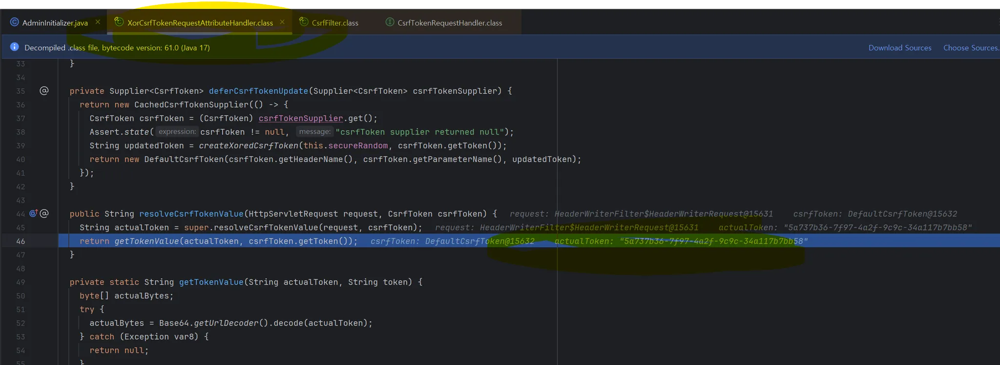

상황 : 코드잇 스프린트 미션 10 JWT + Session 형태 인증/인가 진행 중 CSRF 토큰을 읽어올 수 없다는 에러가 발생했다.

```
25-05-31 22:27:09.959 [http-nio-8080-exec-7] TRACE o.s.security.web.FilterChainProxy - Invoking
CsrfFilter (5/13)
25-05-31 22:27:09.960 [http-nio-8080-exec-7] DEBUG o.s.security.web.csrf.CsrfFilter - Invalid CSRF
token found for http://localhost:8080/api/users
25-05-31 22:27:09.960 [http-nio-8080-exec-7] DEBUG o.s.s.w.a.AccessDeniedHandlerImpl - Responding
with 403 status code
```

-------

문제가 일어난 이유 :

```

CsrfFilter

  protected void doFilterInternal(HttpServletRequest request, HttpServletResponse response, FilterChain filterChain) throws ServletException, IOException {
    DeferredCsrfToken deferredCsrfToken = this.tokenRepository.loadDeferredToken(request, response);
    request.setAttribute(DeferredCsrfToken.class.getName(), deferredCsrfToken);
    CsrfTokenRequestHandler var10000 = this.requestHandler;
    Objects.requireNonNull(deferredCsrfToken);
    var10000.handle(request, response, deferredCsrfToken::get);
    if (!this.requireCsrfProtectionMatcher.matches(request)) {
      if (this.logger.isTraceEnabled()) {
        this.logger.trace("Did not protect against CSRF since request did not match " + this.requireCsrfProtectionMatcher);
      }

      filterChain.doFilter(request, response);
    } else {
      CsrfToken csrfToken = deferredCsrfToken.get();
      String actualToken = this.requestHandler.resolveCsrfTokenValue(request, csrfToken);
      if (!equalsConstantTime(csrfToken.getToken(), actualToken)) { // (v) 조건문
        boolean missingToken = deferredCsrfToken.isGenerated();
        this.logger.debug(LogMessage.of(() -> "Invalid CSRF token found for " + UrlUtils.buildFullRequestUrl(request)));
        AccessDeniedException exception = (AccessDeniedException)(!missingToken ? new InvalidCsrfTokenException(csrfToken, actualToken) : new MissingCsrfTokenException(actualToken));
        this.accessDeniedHandler.handle(request, response, exception);
      } else {
        filterChain.doFilter(request, response);
      }
    }
  }


```

csrfToken.getToken() >
token: 5a737b36-7f97-4a2f-9c9c-34a117b7bb58
parameterName: _csrf
headerName: X-XSRF-TOKEN

actualToken > `null`

csrfToken.getToken()과 actualToken이 일치하지 않아 문제가 발생하고 있었다.


XorCsrfTokenRequestAttributeHandler의 getTokenValue(...)의 인코딩, 디코딩 과정 이후 actualToken이 null로 반환되고 있었다.

---------

해결 :
CsrfTokenRequestAttributeHandler (XOR 기능이 없는 기본 핸들러)로 교체하자, CrsfFilter 를 통과하여 정상작동하는 모습을 보였다.

참고한
자료 :

- [Issue #13599](https://github.com/spring-projects/spring-security/issues/13599)
- [XorCsrf 토큰이란 무엇이고, 왜 써야 하는가(feat. BREACH Attack)](https://velog.io/@eora21/XorCsrf-%ED%86%A0%ED%81%B0%EC%9D%B4%EB%9E%80-%EB%AC%B4%EC%97%87%EC%9D%B4%EA%B3%A0-%EC%99%9C-%EC%8D%A8%EC%95%BC-%ED%95%98%EB%8A%94%EA%B0%80feat.-BREACH-Attack)
- [Using the XorCsrfTokenRequestAttributeHandler (BREACH)](https://docs.spring.io/spring-security/reference/servlet/exploits/csrf.html#csrf-token-request-handler-breach)
- [CSRF 토큰 유지 및 검증](https://bestdevelop-lab.tistory.com/100)