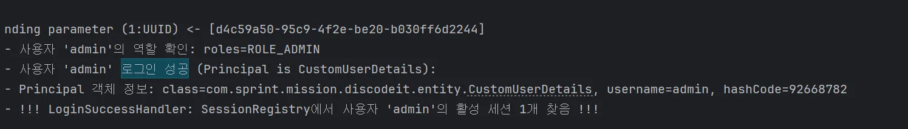

**상황**

SessionRegistry 관련 동시 세션 관리및 세션 찾기 등의 기능이 작동하지 않아 로그인시 세션이 생성되었는지 확인하는 로그를 넣었다. SessionRegistry 는
존재하나, Principal 객체를 찾을 수 없다는 로그가 찍혔다.

**문제가 일어난 이유** :

CustomLoginFilter 를 만들기 위해 상속받은 AbstractAuthenticationProcessingFilter 는
NullAuthenticatedSessionStrategy 를 사용하여, 세션 관련 작업을 수행하지 않는다.

```java
private SessionAuthenticationStrategy sessionStrategy = new NullAuthenticatedSessionStrategy();
```

https://www.inflearn.com/community/questions/946305/sessionmanagementfilter-%EB%8F%99%EC%9E%91%EC%97%AC%EB%B6%80?srsltid=AfmBOopShcmaGR68C_P6QgGR_nmYsPO3t1VmzCyZvuqPRqvVIzK2Lg5A

즉, 커스텀하여 수동으로 설정해주지 않으면 세션 저장및 관리 기능을 이용할 수 없다는 것이었다.

**해결**

스프링 시큐리티에서 사용하는 formLogin 같은 경우에는 초기화될 때 시큐리티가 자동으로 설정하지만, 직접 필터를 생성할 경우에는 수동으로 넣는 작업을 해 주어야 한다. 즉,
`SessionAuthenticationStrategy` 를 **CustomLoginFilter**에 주입해야 한다.

SecurityConfig.java

```java

@Bean
public SessionAuthenticationStrategy sessionAuthenticationStrategy( // 인증 성공시 수행
    SessionRegistry sessionRegistry) {

  // 하단 HttpSecurity 의 sessionManagement 설정과 통일
  // 동시 세션 제어 전략 설정
  ConcurrentSessionControlAuthenticationStrategy concurrentSessionControlAuthenticationStrategy =
      new ConcurrentSessionControlAuthenticationStrategy(sessionRegistry);
  concurrentSessionControlAuthenticationStrategy.setMaximumSessions(1);

  // 세션 고정 보호 전략
  SessionFixationProtectionStrategy sessionFixationProtectionStrategy =
      new SessionFixationProtectionStrategy();

  // 세션 레지스트리 등록
  RegisterSessionAuthenticationStrategy registerSessionAuthenticationStrategy =
      new RegisterSessionAuthenticationStrategy(sessionRegistry);

  return new CompositeSessionAuthenticationStrategy(
      Arrays.asList(
          concurrentSessionControlAuthenticationStrategy,
          sessionFixationProtectionStrategy,
          registerSessionAuthenticationStrategy
      )
  );
}
```

```java

@Bean
public CustomLoginFilter customLoginFilter(
    AuthenticationManager authenticationManager,
    SecurityContextRepository securityContextRepository,
    SessionAuthenticationStrategy sessionAuthenticationStrategy) {
  CustomLoginFilter filter = new CustomLoginFilter(objectMapper);
  filter.setFilterProcessesUrl("/api/auth/login");
  filter.setAuthenticationManager(authenticationManager);
  filter.setAuthenticationSuccessHandler(loginSuccessHandler);
  filter.setAuthenticationFailureHandler(loginFailureHandler);
  filter.setSecurityContextRepository(securityContextRepository);
  filter.setSessionAuthenticationStrategy(sessionAuthenticationStrategy);
  return filter;
}
```

`SessionAuthenticationStrategy`를 빈으로 반환하도록 설정(전체 세션 전략과 통일)하고 `CustomeLoginFilter` 에 override 한
`setSessionAuthenticationStrategy` 에 `sessionAutehnticationStrategy` 를 지정한다.

- HttpSecurity.sessionManagement 설정과 SessionAuthenticationStrategy 설정
    1. HttpSecurity.sessionManagement(...)를 통해 전반적인 세션 관리 및 동시 세션 제어 필터(ConcurrentSessionFilter 등)를
       설정합니다.
    2. CustomLoginFilter가 UsernamePasswordAuthenticationFilter의 역할을 대신하므로, 인증 성공 시점에
       HttpSecurity.sessionManagement()에서 정의한 정책과 일관된 세션 처리(등록, 고정 방어, 이전 세션 만료 등)를 수행하도록 별도의
       SessionAuthenticationStrategy를 구성하여 CustomLoginFilter에 주입합니다.

    - HttpSecurity.sessionManagement 설정 : 시스템 전체의 규칙과 감시
    - CustomLoginFilter SessionAuthenticationStrategy : 로그인 성공이라는 특정 이벤트 발생 시 처리할 행동 정의

    - 핵심은 두 설정이 "일관성"을 가져야 한다는 것.

CustomLoginFilter.java

```java

@Override
public void setSessionAuthenticationStrategy(
    SessionAuthenticationStrategy sessionAuthenticationStrategy) {
  super.setSessionAuthenticationStrategy(sessionAuthenticationStrategy);
}
```

`AbstractAuthenticationProcessingFilter` 의 `setSessionAuthenticationStrategy` 를 오버라이딩해온다.

\
이제야 세션이 생성된다…