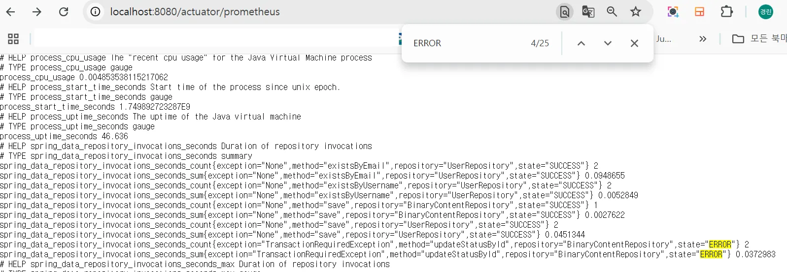
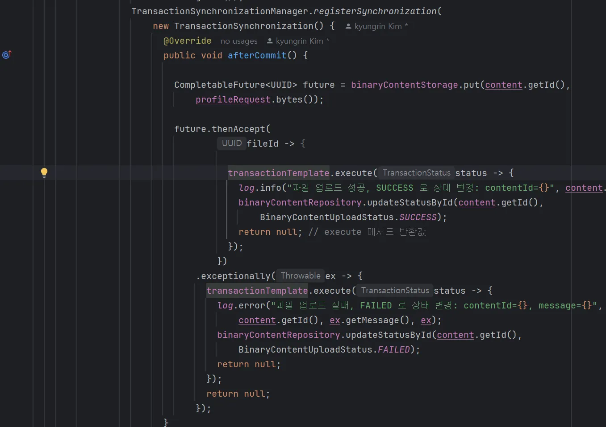
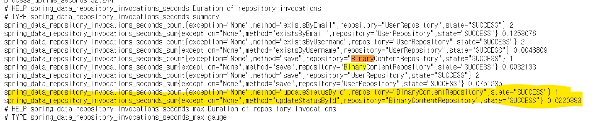

### 상황

1. 메인 트랙잰션이 성공적으로 커밋된 후에 파일 업로드를 수행하기 위해 TransactionSynchronizationManager를 사용했다.
2. 파일 업로드(put())는 @Async 를 통해 비동기로 실행된다. → 결과는 completableFuture 로 반환한다.
3. CompletableFuture 의 성공/실패에 따라 파일의 상태를 DB 에 업데이트하기 위해 thenAccept-exceptionally 콜백을 사용했다.
4. 이때 `TransactionRequiredException` 즉, 트랜잭션이 필요하다는 에러가 발생

### 문제가 일어난 이유 : DB 데이터를 변경하는 모든 작업을 활성화된 트랜잭션 내에서 실행되어야 한다 - 라는 JPA 핵심 규칙을 위반했다.

1. JPA의 규칙 : Spring Data JPA를 사용하여 데이터를 수정하는 메서드를 호출하려면, 해당 호출이 `@Transcational` 등으로 시작된 트랜잭션 컨텍스트
   안에서 이루어져야 한다. → 이 공간 없이는 JPA가 데이터 수정을 허용하지 않는다.
    - 여기서는 `@Modifying` 어노테이션이 적용된 `updateStatusById`
2. CompletableFuture 의 콜백 메서드(thenAccept, exceptinally)는 완전히 새로운 스레드에서 시작된다. → createUser이 감싸던 트랜잭션과
   관련이 없고, 메인 스레드의 트랜잭션은 이미 커밋되어 닫힌 상태이기 때문에 비동기 스레드는 트랜잭션 없이 시작된다.
3. 이때, 트랜잭션 컨텍스트에서 JPA 수정 메서드를 호출하지 않았으므로 `TransactionRequiredException` 가 발생했다.

### 해결 : 트랜잭션 컨텍스트에서 JPA 메서드가 실행될 수 있도록 조정했다.

가독성은 떨어지지만 `transactionTemplate.execute`를 사용하여 트랜잭션을 열었다. (이거 때문에 새로운 메서드를 분리하고, 클래스를 만드는 게 더 품이 많이
들어서… 당장은 할 게 많아서 이렇게…)

정상 작동하고 있다.