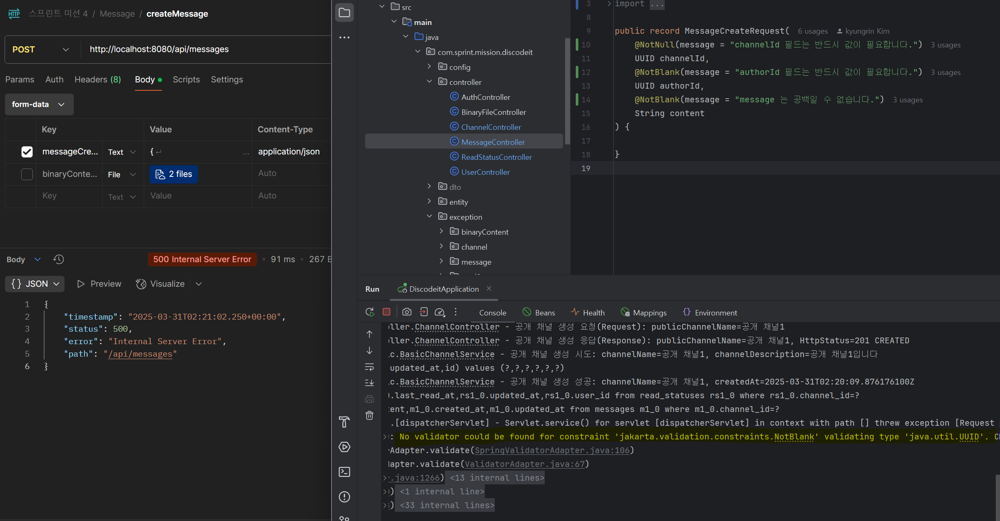

### 상황 :

jakarta.validation.UnexpectedTypeException: HV000030: 'jakarta.validation.constraints.NotBlank' 제약
조건에 대한 유효성 검사기를 찾을 수 없습니다. 'java.util.UUID' 유형을 유효성 검사합니다. 'authorId'에 대한 구성을 확인합니다

### 문제가 일어난 이유 : @NotBlank 제약 조건은 문자열(String) 유형에 적용해야 한다.

UUID 유형에 @NotBlank 제약 조건을 걸어놔 발생한 문제였다.

### 해결 :  @NotBlank -> @NotNull