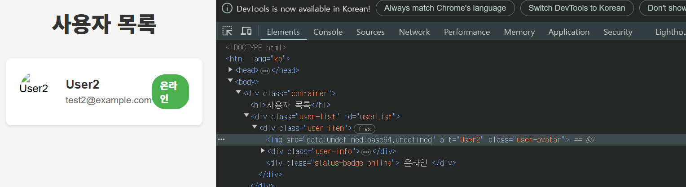
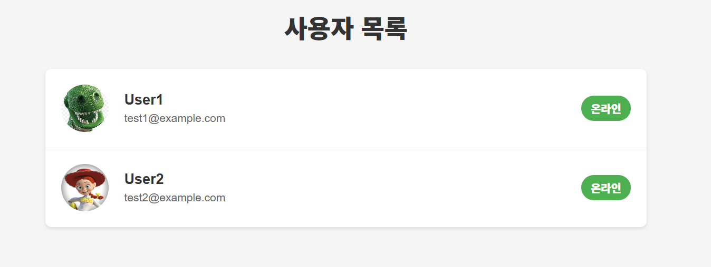

### (2) user-list.html 의 src 전달

-> img의 src가 `"data:undefined;base64,undefined"` 로 반환되고 있었다.

이미지 외의 유저 관련 정보는 다 제대로 전달하고 있기에 제대로 UI가 떴겠지만, 이미지만 전달되지 못하고 있고,
`profile.contentType`, `profile.bytes`이 `undefined`로 전달되고 있으니,
`console.log(profile)`를 이용해 디버깅해보고자 했으나, 콘솔 조차도 찍히지 않고 있었다.

### (3) user-list.html 화면

안되다가 코드를 바꾼 게 없는데 됐다.(정확히는, 알아보겠다고 콘솔에 로그를 찍다가 됐다) 공룡 이미지가 default 이미지고, 제시 이미지가 전송된 이미지이다.

- User의 텍스트 인자들은 html 에 js를 통해 잘 전달됐는데, 이미지가 안 됐었다.
- 이유를 알기 위해 js 측 fetchUserProfile 메서드 내부에서 로그를 찍었었고,
- 콘솔에 로그가 뜨지 않아 어떤 문제인지 파악조차할 수 없었는데,
- 아무 것도 하지 않았는데, 정말 "갑자기" 됐다.

- 노트북 자체의 과열이나 IDE 오류로 인해 안 될 수도 있었던 걸까?

--------

추후 강사님께 말씀드리니, 캐싱 관리를 하나의 방법으로 제시해주셨다.
최초의 캐싱이 잘못되었다면 한동안은 잘못된 데이터가 반환될 수 있다고 하셔 application.yaml에 캐싱 관련 속성을 추가했다.

    web:
        resources:
            cache:
                period: 0

물론 이렇게 하면 속도가 느려지기 때문에 운영단 배포할 때는 빼야한다고 합니다!