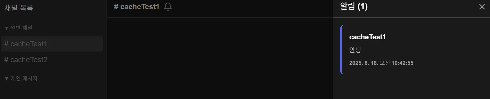

### 상황 :

사용자의 알림을 조회하고 확인할 때, 인증 객체를 통해 사용자를 확인했다. 그러나 `userPrincipal`이 `null` 로 들어오면서 알림 기능이 작동하지 않았다.

```java

@GetMapping
public ResponseEntity<List<NotificationDto>> getNotifications(
    @AuthenticationPrincipal UserPrincipal userPrincipal
) {
  log.info("userPrincipal={}", userPrincipal);
  String username = userPrincipal.getName();

  User user = userRepository.findByUsername(username)
      .orElseThrow(() -> new UserNotFoundException(Map.of("username", username)));
  log.info("알림 조회 시도");
  List<NotificationDto> notificationDtos = notificationService.find(user.getId());

  log.info("알림 조회 완료");
  return ResponseEntity.ok(notificationDtos);
}

@DeleteMapping("/{notificationId}")
public ResponseEntity<Void> delete(
    @PathVariable UUID notificationId,
    @AuthenticationPrincipal UserPrincipal userPrincipal
) {
  String username = userPrincipal.getName();
  User user = userRepository.findByUsername(username)
      .orElseThrow(() -> new UserNotFoundException(Map.of("username", username)));

  log.info("알림 삭제(확인) 시도");
  notificationService.delete(notificationId, user.getId());

  return ResponseEntity.noContent().build();

}
```

---

### 문제가 일어난 이유 :

일반 JWT 토큰을 API를 호출하는 상황에서 `SecurityContext`에 `DiscodeitUserDetials`가 저장되어 있는데, 컨트롤러에서는
`UserPrincipal`타입을 요청하여 타입 불일치로 null이 주입되었다.

**<전체 절차>**

Authorization 헤더 -> JwtAuthenticationFilter -> @AuthenticationPrincipal

**(1) Authorization 헤더**

```
GET /api/notifications
Host:your-server.com
Authorization:
Bearer eyxxxxxxxxxxxxxx.xxxxxxxxx...
```

**(2) Security Filter Chain : JwtAuthenticationFilter**

- 헤더에서 토큰 추출

  Authorization 헤더 확인, Bearer 접두사 제거 → 순수한 JWT 문자열 추출

- 토큰 유효성 검증

  Signature를 통해 확인

- 사용자 정보 추출

  토큰 유효성 검증 통과시, payload에서 사용자 정보(e.g. username)를 추출한다.

- DB에서 사용자 정보 조회

  username으로 DB를 조회하여 사용자 객체를 가져온다.

    ```java
    @Service
    @RequiredArgsConstructor
    public class DiscodeitUserDetailsService implements UserDetailsService {
    
      private final UserRepository userRepository;
      private final UserMapper userMapper;
    
      @Transactional(readOnly = true)
      @Override
      public UserDetails loadUserByUsername(String username) throws UsernameNotFoundException {
        User user = userRepository.findByUsername(username)
            .orElseThrow(() -> new UserNotFoundException(Map.of("username", username)));
    
        return new DiscodeitUserDetails(userMapper.toDto(user), user.getPassword());
      }
    }
    ```

  `UserDetailsService` 를 구현하고 있는 인증 로직인 `DiscodeitUserDetailsService` 에서`loadUserByUsername(…)` 메서드를
  통해 `DiscodeitUserDetails` 를 반환하고 있다.

- `SecurityContext`에 저장

  반환된 `DiscodeitUserDetails` 객체를 사용하여 `Authentication`객체를 생성하고, 해당 객체를 보관하는 `SecurityContext`객체를
  생성한다. → `SecurityContext` 에서는 `authentication.getPrincipal()` 의 반환값으로 `DiscodeitUserDetails` 를
  사용하게 된다.

**(3) @AuthenticationPrincipal**

- 필터 작업 마무리 후 컨트롤러 단의 `@AuthenticationPrincipal` 어노테이션은 `SecurityContextHolder` 에서
  `authentication.getPrincipal()` 를 통해 `DiscodeitUserDetails` 를 가져온다.

<aside>

**UserPrincipal은?**

```java
package java.nio.file.attribute;

import java.security.Principal;

/**
 * A {@code Principal} representing an identity used to determine access rights
 * to objects in a file system.
 *
 * <p> On many platforms and file systems an entity requires appropriate access
 * rights or permissions in order to access objects in a file system. The
 * access rights are generally performed by checking the identity of the entity.
 * For example, on implementations that use Access Control Lists (ACLs) to
 * enforce privilege separation then a file in the file system may have an
 * associated ACL that determines the access rights of identities specified in
 * the ACL.
 *
 * <p> A {@code UserPrincipal} object is an abstract representation of an
 * identity. It has a {@link #getName() name} that is typically the username or
 * account name that it represents. User principal objects may be obtained using
 * a {@link UserPrincipalLookupService}, or returned by {@link
 * FileAttributeView} implementations that provide access to identity related
 * attributes. For example, the {@link AclFileAttributeView} and {@link
 * PosixFileAttributeView} provide access to a file's {@link
 * PosixFileAttributes#owner owner}.
 *
 * @since 1.7
 */

public interface UserPrincipal extends Principal {

}
```

파일 시스템에서 객체에 대한 접근 권한을 결정하는 데 사용되는 Identity이다. `java.nio` 라이브러리 출신

</aside>

---

### 해결 :

`@AuthenticationPrincipal` 어노테이션을 통해 메서드 파라미터로 받아오는 객체 값을 `DiscodeitUserDetails` 로 변경하였다.

```java

@GetMapping
public ResponseEntity<List<NotificationDto>> getNotifications(
    @AuthenticationPrincipal DiscodeitUserDetails principal
) {
  UUID receiverId = principal.getUserDto().id();

  User user = userRepository.findById(receiverId)
      .orElseThrow(() -> new UserNotFoundException(Map.of("receiverId", receiverId)));
  log.info("알림 조회 시도");
  List<NotificationDto> notificationDtos = notificationService.find(user.getId());

  log.info("알림 조회 완료");
  return ResponseEntity.ok(notificationDtos);
}
```

