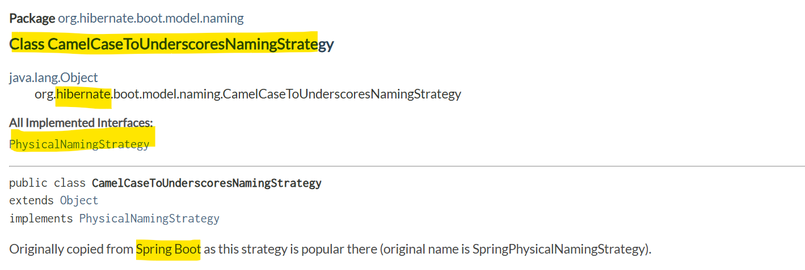

## JPA와 PostgreSQL 매핑

### 1. JPA와 DB의 컬럼 속성(자료형, 길이 등)과 속성의 값들을 일관되게 맞추자.

상황 : DB 테이블에 매핑할 수 있도록 JPA 어노테이션을 통한 Entity 작업을 하고 있을 때, 컬럼 속성과 속성의 값 등이 일치되어야 하는지 궁금해서 찾아봤다.

JPA 어노테이션을 통한 Entity 설정

        @Column(nullable = false, length = 100)
        private String contentType;

DDL을 통한 테이블 생성 중, DB 컬럼 설정 :

        content_type VARCHAR(100) NOT NULL,

`Entity`에서 JPA 어노테이션인 `@Column`의 `length`속성은 문자열 길이를 의미한다.
`length`속성을 설정하지 않는다면 PostgreSQL에서는 무제한 길이로 설정되어 입력된 문자열 길이만큼 메모리를 차지하게 된다.
SQL 명령어를 통해 DB에 설정된 VARCHAR(100)는 PostgreSQL의 자료형 타입 중 하나로, 가변의 문자열 타입이다.

이 두 수치를 맞추지 않아도 문제가 즉시 발생하진 않지만 문제의 원인이 될 수 있다,
예를 들어 length > VARCHAR 로 지정했다면, length - VARCHER 만큼 문자열 데이터가 손실될 수 있다.

-----

### 2. Hibernate의 네이밍 전략(Naming Strategy)

상황 : 객체의 속성명과 데이터베이스 테이블의 컬럼명이 일치되어야 하는가 궁금해서 찾아봤다.

객체에서 속성명이 카멜 케이스로 작성되었다면, DB의 테이블에서는 스네이크 케이스로 변환해준다.

- spring.jpa.hibernate.naming.physical-strategy
- spring.jpa.hibernate.naming.implicit-strategy

Hibernate 는 두 개의 다른 네이밍 전략을 가지고 있다.

    By default, Spring Boot configures the physical naming strategy with
    CamelCaseToUnderscoresNamingStrategy. Using this strategy, all dots are replaced by underscores and
    camel casing is replaced by underscores as well

Spring Boot 에서는 이 중에서 `CamelCaseToUnderscoresNamingStrategy`를 사용한 physical naming strategy를 따른다.

https://wikidocs.net/161165
https://docs.spring.io/spring-boot/how-to/data-access.html#howto.data-access.configure-hibernate-naming-strategy
https://docs.jboss.org/hibernate/orm/6.6/javadocs/org/hibernate/boot/model/naming/CamelCaseToUnderscoresNamingStrategy.html

-----