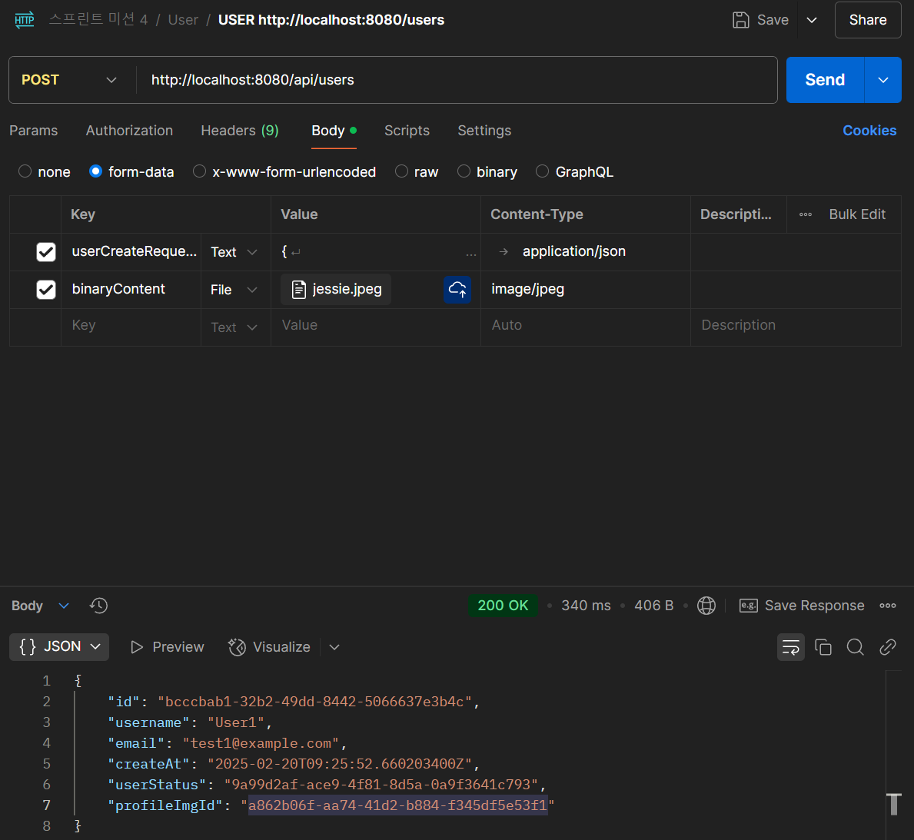
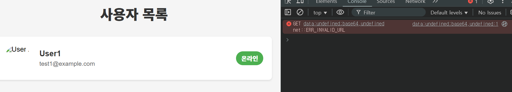
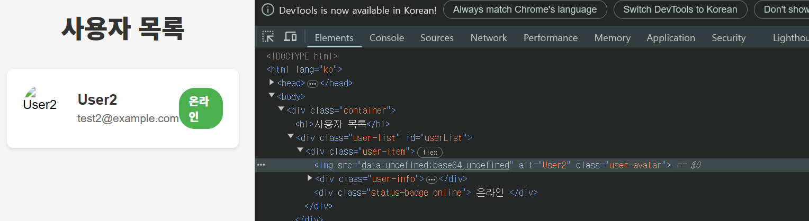
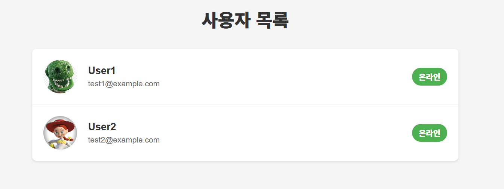

### 파일 업로드 multipart/form-data

파일 업로드를 한다면, @RequestPart 어노테이션을 일반적으로 사용한다고 합니다.
(0) 제공된 script.js의 변수명 내 변수 이름과 동일하게 변경 -> (1) User Controller의 createUser 수정 -> (2)Postman 설정
순서로 진행했습니다.

(1) consumes를 통해 mediaType을 지정하고, 각 파라미터 메서드의 어노테이션을 @RequestPart 로 변경했다.

    @RequestMapping(method = RequestMethod.POST, consumes = {MediaType.MULTIPART_FORM_DATA_VALUE})
    public ResponseEntity<UserCreateResponse> createUser(
            @RequestPart(value = "userCreateRequest") UserCreateRequest userCreateRequest,
            // multipart/form-data 형식으로 요청보낼 때 파일의 키 이름을 "binaryContent"
            @RequestPart(value = "binaryContent", required = false) MultipartFile file) throws Exception {

        BinaryContentCreateRequest binaryContentCreateRequest;
        if(file != null){
            binaryContentCreateRequest = new BinaryContentCreateRequest(file);
        }else {
            binaryContentCreateRequest = null;
        }

        UserCreateResponse userCreateResponse = userService.createUser(userCreateRequest, binaryContentCreateRequest);
        // .ok 응답코드 200 + body
        return ResponseEntity.ok(userCreateResponse);
    }

(2) Postman에서 Working directory 연결, Body를 form-data로 전송

[Postman에서 Content-type을 명시하자
](https://velog.io/@songunnie/Spring-Resolved-org.springframework.web.HttpMediaTypeNotSupportedException-Content-type-applicationoctet-stream-not-supported-%EC%97%90%EB%9F%AC-%ED%95%B4%EA%B2%B0%ED%95%98%EA%B8%B0
)

잘 전달되고 있다!

### script.js의 fetchUserProfile

    async function fetchUserProfile(profileId) {
    try {
    // const response = await fetch(`${ENDPOINTS.BINARY_CONTENT}?binaryContentId=${id}`);
    const response = await fetch(`${ENDPOINTS.BINARY_CONTENT}/${profileId}`);
    if (!response.ok) throw new Error('Failed to fetch profile');
    const profile = await response.json();
    
            // Convert base64 encoded bytes to data URL
            return `data:${profile.contentType};base64,${profile.bytes}`;
        } catch (error) {
            console.error('Error fetching profile:', error);
            return '/default-avatar.png'; // Fallback to default avatar
        }
    }

default 이미지의 경우 등록이 되는데,
Postman에서 전송하는 이미지 자체가 "없는 것"으로 판단되어, 항상 default 이미지만 등록되는 문제가 있었다.

    // Get profile image URL
    const profileUrl = user.profileId ?

자바스크립트 내의 코드상에 작성된 코드를 보고 유저에게서 Id를 가져온다고 생각해서,
"Entity에 직접 접근"이라고 생각했었다.

그러나 `USERS: ${API_BASE_URL}/users` 이고,
`const response = await fetch(ENDPOINTS.USERS)`에서 `fetch()` 함수의 기본 HTTP 메서드 `GET`을 이용하는 거고,
생각해보니 HTTP 메서드 `GET`으로 `/api/users` 엔드포인트로 접근하면...

    @RequestMapping(method = RequestMethod.GET)
    public ResponseEntity<Collection<UserFindResponse>> findAllUsers(){
        return ResponseEntity.ok(userService.showAllUsers());
    }

UserFindResponse DTO 를 응답받을 수 있었다.
**예전에 고의적으로 UserFindResponse DTO에서 profileId는 빼놨었다.** 해당 DTO를 만들 당시에는 정적 사이트를 서빙하는 조건이 없었기에
필요가 없을 거라 생각했었던 것 같다.
때문에 profileId를 UserFindResponse 에 포함시켰고, Id 전달을 위해 관련 추가적으로 작업했다.

### (1) user-list.html 화면과 콘솔

미동도 없던 것이 움직이기 시작했다.
이 문제를 해결하기 위해, users-list.html 페이지의 개발자 도구를 켜서 사용자 프로필 이미지가 어떤 주소로 매핑되어 있는지 확인했다.
`data:${profile.contentType};base64,${profile.bytes}` _* script.js fetchUserProfile 메서드가 반환하는 주소 값_

### (2) user-list.html 의 src 전달

-> img의 src가 `"data:undefined;base64,undefined"` 로 반환되고 있었다.

이미지 외의 유저 관련 정보는 다 제대로 전달하고 있기에 제대로 UI가 떴겠지만, 이미지만 전달되지 못하고 있고,
`profile.contentType`, `profile.bytes`이 `undefined`로 전달되고 있으니,
`console.log(profile)`를 이용해 디버깅해보고자 했으나, 콘솔 조차도 찍히지 않고 있었다.

### (3) user-list.html 화면

안되다가 코드를 바꾼 게 없는데 됐다.(정확히는, 알아보겠다고 콘솔에 로그를 찍다가 됐다) 공룡 이미지가 default 이미지고, 제시 이미지가 전송된 이미지이다.

- User의 텍스트 인자들은 html 에 js를 통해 잘 전달됐는데, 이미지가 안 됐었다.
- 이유를 알기 위해 js 측 fetchUserProfile 메서드 내부에서 로그를 찍었었고,
- 콘솔에 로그가 뜨지 않아 어떤 문제인지 파악조차할 수 없었는데,
- 아무 것도 하지 않았는데, 정말 "갑자기" 됐다.

- 노트북 자체의 과열이나 IDE 오류로 인해 안 될 수도 있었던 걸까?

--------

추후 강사님께 말씀드리니, 캐싱 관리를 하나의 방법으로 제시해주셨다.
최초의 캐싱이 잘못되었다면 한동안은 잘못된 데이터가 반환될 수 있다고 하셔 application.yaml에 캐싱 관련 속성을 추가했다.

    web:
        resources:
            cache:
                period: 0

물론 이렇게 하면 속도가 느려지기 때문에 운영단 배포할 때는 빼야한다고 합니다!